# Название проекта

<div align="center">

### Clarity — ИИ-помощник пациента на маршруте «МРТ головного мозга с контрастом»

**Diagnostic Companion · MedHub HAQathon · кейс Green Clinic**

        

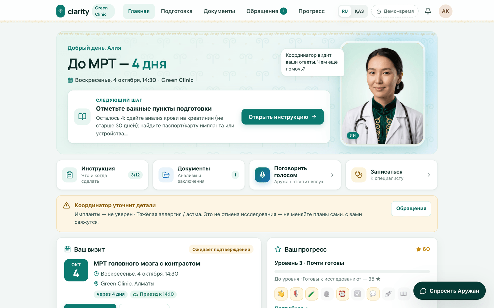

<sub>Главная пациента: ИИ-аватар Аружан, один понятный «следующий шаг» и статус всего маршрута</sub>

**[Живое демо — mabida.tj](https://mabida.tj)** · [Сценарий за 3 минуты](#демо-сценарий-за-3-минуты) · [Архитектура](#архитектура) · [Безопасность](#безопасность-и-этика) · [Метрики](#метрики)

</div>

**Clarity** ведёт пациента по маршруту «МРТ головного мозга с контрастом» от записи до консультации специалиста. До исследования помощник проверяет противопоказания и анализ креатинина (рСКФ по CKD-EPI 2021), выдаёт персональную инструкцию с конкретными датами и напоминает о визите. После исследования он объясняет заключение простым языком — с обязательной оговоркой, что результат интерпретирует врач, — а при тревожных формулировках предлагает ближайшее время у нужного специалиста и записывает после «да». Ассистент говорит голосом по-русски и по-казахски через ИИ-аватар **Аружан**, у которого всегда виден значок «ИИ».

Главный принцип: **LLM разговаривает — правила решают.** Флаги противопоказаний, рСКФ, уровень тревожности заключения, выбор специалиста и эскалации вычисляют детерминированные функции, покрытые тестами. Всё, что требует клинического решения, уходит координатору и врачу. Без ключа LLM все сценарии работают на правилах.

**Команда:** 036 — <!-- TODO: название команды и участники -->

> [!IMPORTANT]
> Это прототип, а не медицинское изделие. Clarity не ставит диагнозы, не решает вопрос о введении контраста и не отменяет исследования. Клинический контент демонстрационный: перед пилотом его должен утвердить назначенный врач Green Clinic. В демо только синтетические данные.

> **Қысқаша (қазақша)**
>
> **Clarity** — контрастпен жасалатын бас миының МРТ-сына дайындалып жүрген пациентке арналған ЖИ-көмекші. Ол қарсы көрсетілімдерді тексереді, креатинин талдауы бойынша шумақтық сүзілу жылдамдығын (ШСЖ, CKD-EPI 2021) есептейді, нақты күндері бар дайындық нұсқаулығын береді және сапар туралы еске салады. Зерттеуден кейін қорытындыны қарапайым тілмен түсіндіреді (нәтижені емдеуші дәрігер түсіндіреді деген ескертпемен), ал алаңдатарлық тұжырымдар табылса, маманға жазылуды ұсынады. Медициналық маңызы бар шешімдерді тілдік модель емес, тестілермен тексерілген детерминді ережелер мен клиника қызметкерлері қабылдайды; күмәнді жауаптар үйлестірушіге автоматты түрде жіберіледі. Интерфейс, диалог, дауыс (Piper) және қауіпсіздік сүзгілері орыс және қазақ тілдерінде жұмыс істейді; «Аружан» аватарында «ЖИ» белгісі әрқашан көрінеді. Бүкіл стек ашық бастапқы кодқа негізделген. Демо: [mabida.tj](https://mabida.tj) — тек синтетикалық деректер.

<details open>
<summary><b>Содержание</b></summary>

1. [Проблема](#проблема)
2. [Решение](#решение) — [как закрыт каждый пункт задачи](#как-закрыт-каждый-пункт-задачи) · [возможности по этапам](#возможности-по-этапам-маршрута) · [кто принимает решения](#кто-принимает-решения)
3. [Демо](#демо) — [галерея](#галерея) · [демо-сценарий за 3 минуты](#демо-сценарий-за-3-минуты)
4. [Запуск](#запуск) — [Docker](#вариант-1--docker-одна-команда) · [локально](#вариант-2--локальная-разработка) · [переменные окружения](#переменные-окружения) · [тесты](#тесты-и-проверки)
5. [Структура проекта](#структура-проекта)
6. [Что готово](#что-готово) — [известные ограничения](#известные-ограничения)
7. [Архитектура](#архитектура) — [ключевые технические решения](#ключевые-технические-решения) · [открытый стек и лицензии](#открытый-стек-и-лицензии)
8. [Безопасность и этика](#безопасность-и-этика)
9. [Метрики](#метрики)
10. [Дорожная карта](#дорожная-карта)
11. [Документация](#документация) · [Лицензия и атрибуция](#лицензия-и-атрибуция)

</details>

## Проблема

Перед МРТ, КТ, эндоскопией и маммографией пациенту нужно **проверить противопоказания, сдать анализы и подготовиться**. Нарушения подготовки ведут к **отменам и повторным звонкам** в клинику. После исследования пациент получает **заключение** и может не понять его без врача: не ясно, что означают термины, срочно ли это и к кому идти.

**Задача кейса.** Помощник пациента должен:

1. проверить противопоказания и анализы;
2. дать инструкцию по подготовке и напомнить о визите;
3. после исследования объяснить заключение простым языком — с оговоркой, что интерпретирует врач;
4. при тревожных формулировках записать к специалисту.

- **Рамки:** MVP — один маршрут (**МРТ с контрастом**); стек — **open source** (требование Green Clinic).
- **Метрики успеха:** отмены, нарушения подготовки, повторные звонки, конверсия в консультацию.

Для MVP мы выбрали **МРТ головного мозга с контрастом**: в одном маршруте есть всё, что требует кейс, — вопросы о безопасности (импланты, металл, беременность), обязательный анализ (креатинин для оценки функции почек перед контрастом), подготовка (интервал без еды, документы, одежда без металла), напоминания, текстовое заключение с медицинскими терминами и переход к профильному специалисту.

## Решение

Clarity — адаптивное веб-приложение (телефон и компьютер) из двух частей:

- **кабинет пациента** с ИИ-ассистентом: реалистичный аватар **Аружан** или робот **Клэри** на выбор, разговор текстом или голосом на русском и казахском;
- **рабочее место клиники**: очередь координатора, реестр и карточка пациента для врача, дашборд метрик кейса.

Формы в интерфейсе и ассистент вызывают одни и те же серверные функции (`clarity/server/services.ts`). Поэтому события метрик и задачи координатора одинаковы, как бы пациент ни действовал: нажал кнопку, написал в чат или сказал голосом.

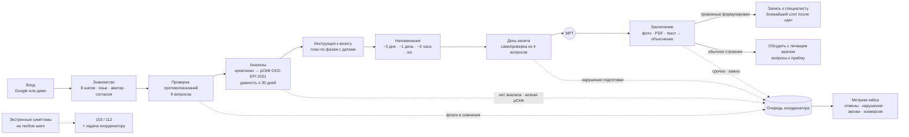
```mermaid
flowchart LR
  R["Вход<br/>Google или демо"] --> O["Знакомство<br/>8 шагов · язык · аватар · согласия"]
  O --> S["Проверка противопоказаний<br/>9 вопросов"]
  S --> L["Анализы<br/>креатинин → рСКФ CKD-EPI 2021<br/>давность ≤ 30 дней"]
  L --> P["Инструкция к визиту<br/>план по фазам с датами"]
  P --> RM["Напоминания<br/>−3 дня · −1 день · −3 часа · .ics"]
  RM --> D["День визита<br/>самопроверка из 4 вопросов"]
  D --> MRI(("МРТ"))
  MRI --> RP["Заключение<br/>фото · PDF · текст → объяснение"]
  RP -->|"тревожные формулировки"| B["Запись к специалисту<br/>ближайший слот после «да»"]
  RP -->|"обычное строение"| GP["Обсудить с лечащим врачом<br/>вопросы к приёму"]
  S -.->|"флаги и сомнения"| Q[("Очередь координатора")]
  L -.->|"нет анализа · низкая рСКФ"| Q
  D -.->|"нарушение подготовки"| Q
  RP -.->|"срочно · важно"| Q
  Q --> M["Метрики кейса<br/>отмены · нарушения · звонки · конверсия"]
  EM["Экстренные симптомы<br/>на любом шаге"] -.-> E103["103 / 112<br/>+ задача координатору"]
```

### Как закрыт каждый пункт задачи

| Требование | Как реализовано | Где в коде |
| --- | --- | --- |
| **Проверить противопоказания** | 9 вопросов версионируемого протокола: кардиостимулятор/ИКД, импланты, металл, почки, реакция на контраст, тяжёлая аллергия/астма, беременность\*, грудное вскармливание\*, клаустрофобия. Ответ кнопкой, свободным текстом или голосом на ru/kk; «не помню» — отдельный исход. Правила `onYes`/`onUnknown` дают флаги `info`/`review`/`critical` и организационный статус: `ready`, `needs_review` или `hold_for_review` («нужно решение врача до визита»). Каждый флаг сразу становится задачей координатору с приоритетом | [`domain/protocol.ts`](clarity/server/domain/protocol.ts), [`domain/screening.ts`](clarity/server/domain/screening.ts), [`services.ts`](clarity/server/services.ts) (`recomputeScreening`) |
| **Проверить анализы** | Креатинин вводится в чате («креатинин 84», мг/дл пересчитываются в мкмоль/л) вместе с датой сдачи («сдавала 20.09») или берётся из загруженного бланка. Сервер считает рСКФ по **CKD-EPI 2021** и проверяет давность (≤ 30 дней). Пороги 45 и 30 мл/мин/1,73 м² вынесены в конфигурацию протокола. Нет анализа, анализ устарел или рСКФ снижена → флаг и задача | [`domain/screening.ts`](clarity/server/domain/screening.ts) (`egfrCkdEpi2021`), [`domain/nlu.ts`](clarity/server/domain/nlu.ts) (`parseCreatinine`, `parseLabDate`) |
| …и разобрать бланк анализов | Фото, PDF, текст или ручной ввод → **пациент проверяет распознанные значения** → разбор каждого показателя **только по референсу из бланка лаборатории** (нет референса — не сравниваем), каталог из 25 показателей, «панические» значения → срочная задача. Креатинин из бланка автоматически попадает в проверку перед МРТ | [`documents/`](clarity/server/documents/) (`extract.ts`, `labParser.ts`, `labAnalysis.ts`, `labsCatalog.ts`), [`patient/docs/`](clarity/src/patient/docs/) |
| **Дать инструкцию по подготовке** | Персональный план по фазам «за 3 дня → накануне → в день → после»: 9 базовых пунктов и персональные по ответам анкеты (паспорт импланта, ингалятор, вопрос о кормлении, клаустрофобия). Экран «Инструкция к визиту» — шкала с конкретными датами и временем (последний приём пищи, приезд), блок «что сделать сейчас», озвучка и печать. По запросу «что мне делать?» ассистент выдаёт план по дням | [`domain/prep.ts`](clarity/server/domain/prep.ts), [`domain/protocol.ts`](clarity/server/domain/protocol.ts) (`PREP_BANK`), [`patient/PrepPage.tsx`](clarity/src/patient/PrepPage.tsx) |
| **Напомнить о визите** | Расписание от времени визита: за 72, 24 и 3 часа (или только накануне). Доставка в приложение и в уведомления браузера, файл календаря `.ics` с тремя будильниками. Подтверждение визита, перенос или отмена с причиной (→ задача «перезвонить»). В день визита — самопроверка из 4 вопросов: нарушение подготовки фиксируется и уходит координатору **до** приезда пациента | [`domain/prep.ts`](clarity/server/domain/prep.ts) (`buildReminders`), [`domain/ics.ts`](clarity/server/domain/ics.ts), [`services.ts`](clarity/server/services.ts) (`deliverDue`, `dayOfCheck`) |
| **Объяснить заключение простым языком** | Заключение фотографией, PDF или текстом → распознанный текст пациент проверяет → разбор по предложениям и клаузам: словарь из 30 терминов, учёт отрицаний («не выявлено», «без признаков»), «не исключается» считается подозрением, а не отрицанием. Уровень `routine`/`follow_up`/`urgent`, вопросы к врачу. LLM (если доступна) только пересказывает текст, уровень задают правила | [`domain/report.ts`](clarity/server/domain/report.ts) (`analyzeReport`), [`assistant/llm.ts`](clarity/server/assistant/llm.ts) (`simplifyReport`), [`patient/docs/ReportSection.tsx`](clarity/src/patient/docs/ReportSection.tsx) |
| **Оговорка, что интерпретирует врач** | Дисклеймер встроен в каждое объяснение («Это объяснение терминов, а не диагноз. Результат интерпретирует лечащий врач…»), в пересказ LLM и в объяснение анализов. Фильтр ответов отбрасывает формулировки-диагнозы и ложные заверения | [`domain/report.ts`](clarity/server/domain/report.ts), [`domain/safety.ts`](clarity/server/domain/safety.ts) (`violatesOutputPolicy`) |
| **При тревожных формулировках записать к специалисту** | 19 правил-маркеров трёх уровней: `urgent` (кровоизлияние, острая ишемия, смещение срединных структур, масс-эффект…), `significant` (образование, метастаз, аневризма, демиелинизация…), `minor` (глиоз, кисты, пазухи, атрофия). Специалист определяется по самому серьёзному маркеру. Ассистент сразу предлагает ближайший слот («Записать вас к нейрохирургу на …?») и записывает после явного «да». Координатор получает задачу (`urgent` — «связаться сегодня»). Запись идемпотентна | [`domain/report.ts`](clarity/server/domain/report.ts) (`RED_FLAGS`), [`domain/slots.ts`](clarity/server/domain/slots.ts), [`services.ts`](clarity/server/services.ts) (`explainReport`, `bookSlot`), [`assistant/dialog.ts`](clarity/server/assistant/dialog.ts) |
| **MVP: один маршрут — МРТ с контрастом** | Протокол `mri-brain-contrast` (версия `demo-0.3`, помечена «не утверждено клинически»): вопросы, пороги, банк подготовки и самопроверка — данные, а не код. Новый маршрут — это новый протокол, база знаний и словарь | [`domain/protocol.ts`](clarity/server/domain/protocol.ts) |
| **Стек — open source** | Все runtime-зависимости под MIT/ISC/Apache-2.0. LLM — открытые модели через OpenAI-совместимый API: можно подключить собственный vLLM/Ollama клиники без изменения кода. Голоса Piper синтезируются локально на сервере | [`package.json`](clarity/package.json), [`assistant/llm.ts`](clarity/server/assistant/llm.ts), [`tts/`](clarity/server/tts/), [стек и лицензии](#открытый-стек-и-лицензии) |
| **Метрики: отмены, нарушения подготовки, повторные звонки, конверсия** | Каждое действие пишет событие (24 типа) с когортой `baseline`/`clarity`. Четыре метрики, воронка и причины отмен считаются из журнала событий и показаны в дашборде клиники | [`domain/metrics.ts`](clarity/server/domain/metrics.ts), [`staff/MetricsDashboard.tsx`](clarity/src/staff/MetricsDashboard.tsx), [раздел «Метрики»](#метрики) |

\* — только для пациенток: пол указывается при знакомстве, он же нужен для формулы рСКФ.

### Возможности по этапам маршрута

<details open>
<summary><b>1. Вход и знакомство</b></summary>

- Вход через **Google** (OAuth 2.0 / OpenID Connect + PKCE) или один из трёх **демо-входов**: «Я пациент — первый вход», «Пациентка Алия» (маршрут уже начат), «Сотрудник клиники».
- **Знакомство из 8 шагов** с голосом ассистента: язык (RU / ҚАЗ) → аватар (Аружан или Клэри) → имя → год рождения и пол («нужны для расчёта функции почек») → выбор окна МРТ из демо-расписания → первое ли МРТ, уровень волнения, что беспокоит → голос и крупный шрифт → два явных согласия (на обработку данных и «понимаю, что это ИИ-помощник, а не врач»).
- Собирается только то, что нужно маршруту. Опасения из анкеты ассистент учитывает в разговоре.

</details>

<details open>
<summary><b>2. Проверка противопоказаний и анализа</b></summary>

- Анкету можно пройти в форме или в разговоре. В разговоре работают свободные ответы: «нет», «не помню точно», «да, у меня астма», «иә», «жоқ», «есімде жоқ».
- Посреди анкеты можно задать вопрос («Можно ли пить воду перед МРТ?»): ответ приходит из базы знаний со ссылкой на карточку и её версию, после чего ассистент возвращается к анкете.
- Итоговая сводка: статус, флаги с пояснением «что будет дальше», рСКФ, давность анализа. Статус «Нужно решение врача до визита» не отменяет визит автоматически — решение за человеком.

</details>

<details open>
<summary><b>3. Документы: анализы</b></summary>

- Раздел «Документы»: фото бланка (камера телефона), PDF (текстовый слой через pdfjs, до 10 страниц), текст или ручной ввод. Файл до 8 МБ; исходный файл на сервере не сохраняется — хранятся только значения, которые подтвердил пациент.
- Для текста и PDF сначала работают правила; фото распознаёт vision-модель (см. [ограничения](#известные-ограничения)).
- **Пациент проверяет и исправляет значения до анализа.** Статус показателя определяется только относительно референса из бланка или отметки лаборатории (H/L/↑/↓). Референс никогда не придумывается.
- Понятные пояснения («может встречаться при…, оценивает врач»), рекомендации без диагнозов, профильный специалист (терапевт, нефролог, эндокринолог), вопросы к врачу.
- Блок «Для МРТ»: креатинин из бланка → мкмоль/л → рСКФ; если анализ свежее уже внесённого, он переносится в проверку перед МРТ.
- Критические значения (например, креатинин > 500 мкмоль/л, калий < 2,8 или > 6,2 ммоль/л) → срочная задача координатору и совет связаться с врачом сегодня.

</details>

<details open>
<summary><b>4. Инструкция и напоминания</b></summary>

- «Инструкция к визиту»: сводка, «что сделать сейчас», шкала с датами (за 3 дня, накануне, в день МРТ, после), озвучка голосом ассистента, печать.
- Отметки пунктов хранятся на сервере; важные пункты помечены.
- Напоминания: «За 3 дня, за день и за 3 часа», «Только за день» или «Без напоминаний». Тексты конкретные: «Не ешьте за 4 ч до исследования, воду пить можно».
- Файл `.ics` с будильниками `-P3D`, `-P1D`, `-PT3H` для любого календаря.
- Подтверждение визита, перенос или отмена с причиной — координатор получает задачу освободить слот.

</details>

<details open>
<summary><b>5. День визита</b></summary>

- Баннер самопроверки на главной: не ел ли пациент 4 часа, взяты ли направление, документ и креатинин, сняты ли металлические предметы.
- Ответ «Нет» → событие `prep_violation` и задача координатору «Нарушение подготовки» с выбором «проводить или перенести» — **до** того, как пациент приехал.

</details>

<details open>
<summary><b>6. Объяснение заключения</b></summary>

- Каждое предложение заключения получает пояснение на языке пациента: «описание обычного строения», «врач отмечает, что изменений этого типа не обнаружено», «частая находка — обсудите на приёме», «требует консультации специалиста», «нужно срочно обсудить с врачом».
- Термины подсвечиваются и объясняются (до 4 на предложение), итог с уровнем внимания, вопросы к врачу («Что означает „…“ в моём случае?», «Нужны ли дополнительные исследования или контрольная МРТ?»).
- Три встроенных синтетических примера: «Норма», «Есть находка», «Срочное».
- Вопросы по своему документу текстом или голосом: «что значит глиоз в моём заключении?» — ассистент отвечает с контекстом документа и без диагнозов.

</details>

<details open>
<summary><b>7. Запись к специалисту</b></summary>

- Демо-расписание 7 специальностей (невролог, нейрохирург, онколог, эндокринолог, ЛОР-врач, терапевт, нефролог), очный или онлайн-формат, при срочном уровне слоты с ближайшего дня.
- В чате: «Записать вас к неврологу на четверг, 11:00?» → «да» → запись. Если пациент сменил тему, отложенное «да» не запишет его молча.
- Повторная запись на тот же слот возвращает существующую запись (идемпотентность).

</details>

<details open>
<summary><b>8. Экстренные ситуации и границы</b></summary>

- Фразы вроде «мне трудно дышать», «отекает горло», «боль в груди», «судороги», «онемела половина лица», а также казахские аналоги («дем ала алмаймын», «тамағым ісіп кетті» и др.) → **103 / 112** немедленно, без обращения к LLM; координатор получает задачу с пометкой «СРОЧНО».
- «Можно ли мне не пить таблетки?», «какой у меня диагноз?», «сколько мг?» → «Этот вопрос может решить только врач» + передать координатору или записаться.

</details>

<details open>
<summary><b>9. Разговор с ассистентом: текст и голос</b></summary>

- **Чат** с быстрыми ответами и карточками: сводка проверки, план подготовки, напоминания, заключение, слоты, источники.
- **Голосовой разговор** в режиме «звонка»: ассистент говорит, затем сам начинает слушать. Перебить можно кнопкой, тапом по аватару или пробелом. После двух пустых попыток — пауза, микрофон не слушает бесконечно. Кнопки и карточки остаются на экране: голос не заменяет визуальное подтверждение.
- **Озвучка** — серверные голоса Piper (ru — Ирина, kk — ISSAI KazakhTTS2). Синтез идёт по фразам, следующая фраза загружается заранее. Запасные пути: голос браузера, затем режим субтитров.
- **Липсинк по звуку**: губы Аружан движутся по реальному аудио, а не по таймеру.
- **База знаний**: 18 карточек с версиями (контраст, еда и вода, лекарства, шум, клаустрофобия, металл и тату, импланты, беременность, креатинин, что взять, результаты, перенос, адрес, сопровождающий, «кто такой ИИ-помощник»).

</details>

<details open>
<summary><b>10. Двуязычие ru / kk</b></summary>

- Интерфейс, сценарий диалога, анкета, подготовка, напоминания, база знаний, объяснение заключения и анализов, слой безопасности, озвучка и распознавание речи (kk-KZ) работают на русском и казахском. Переключатель RU / ҚАЗ есть в шапке, на входе и на первом шаге знакомства; выбор сохраняется в профиле.
- Казахские шаблоны безопасности срабатывают и на тексте без казахской раскладки (қ→к, ә→а…).
- Тексты для персонала остаются на русском: так клиника ведёт медицинскую документацию.

</details>

<details open>
<summary><b>11. Бережная геймификация</b></summary>

- «Звёзды заботы»: 10 значков, 5 уровней («Начало пути» → «Путь пройден»), до 130 звёзд, празднование с конфетти.
- Значки даются **только за организационные действия**: знакомство, проверка, внесённый анализ, собранная подготовка, напоминания, подтверждённый визит, вопрос ассистенту, самопроверка, прочитанное заключение, запись на рекомендованную консультацию.
- Ничего не начисляется за медицинские показатели или «хорошее» заключение. Нет рейтингов, штрафов, таймеров и серий дней.

</details>

<details open>
<summary><b>12. Рабочее место клиники</b></summary>

- **Очередь координатора**: задачи создаются автоматически (анкета, анализы, вопросы пациентов, тревожные заключения, перезвон, нарушения подготовки) с приоритетами «срочно / высокий / обычный». Счётчики срочных и открытых задач, визитов «ждут решения врача» и подтверждённых визитов.
- **Реестр пациентов** с фильтрами «Требуют внимания» и «Ближайшие 3 дня» и поиском.
- **Карточка пациента для врача**: ответы анкеты с подсветкой, креатинин и рСКФ, заключение с маркерами, подтверждённые анализы, записи, история событий, «Печать». Кнопки «Учесть звонок», «Пришёл», «Пришёл, нарушение», «Неявка», «Отметить „состоялась“» для консультации.
- **Метрики**: 4 показателя кейса (база и группа Clarity), воронка, причины отмен.

</details>

### Кто принимает решения

| Этап | Что делает Clarity | Кто решает |
| --- | --- | --- |
| Противопоказания | Собирает ответы, отмечает флаги, ставит задачу | Координатор и врач-рентгенолог |
| Анализы | Считает рСКФ по формуле, проверяет давность, разбирает бланк по референсу лаборатории | Врач |
| Подготовка и напоминания | Строит план по протоколу, напоминает, фиксирует нарушения | Протокол клиники, координатор |
| Заключение | Объясняет термины, определяет уровень внимания по словарю маркеров | Интерпретирует лечащий врач |
| Консультация | Предлагает слот нужной специальности | Пациент подтверждает сам |
| Экстренное | Направляет в 103 / 112 и ставит задачу | Экстренные службы |

## Демо

**Живое демо: [https://mabida.tj](https://mabida.tj)**

- На экране входа есть кнопки демо-входа без аккаунта: **«Я пациент — первый вход»** (регистрация и знакомство), **«Пациентка Алия»** (маршрут уже начат), **«Сотрудник клиники»** (очередь, реестр, метрики).
- Все данные синтетические: пациенты, расписание, заключения и история метрик созданы генератором. Не вводите реальные медицинские данные.
- Голос лучше всего работает в Chrome: распознавание речи идёт через браузер, микрофон включается только после предупреждения о приватности. Включите звук — ассистент говорит.
- **Демо-время** (часы в шапке) перематывает время маршрута: «За 3 дня до МРТ», «Накануне (за 23 ч)», «В день МРТ (за 2 ч)», «Через 2 дня после МРТ».
- Если LLM недоступна, ассистент продолжает работать на правилах: все сценарии кейса доступны.

### Галерея

**Вход и знакомство**

<table>
<tr>
<td align="center" width="50%">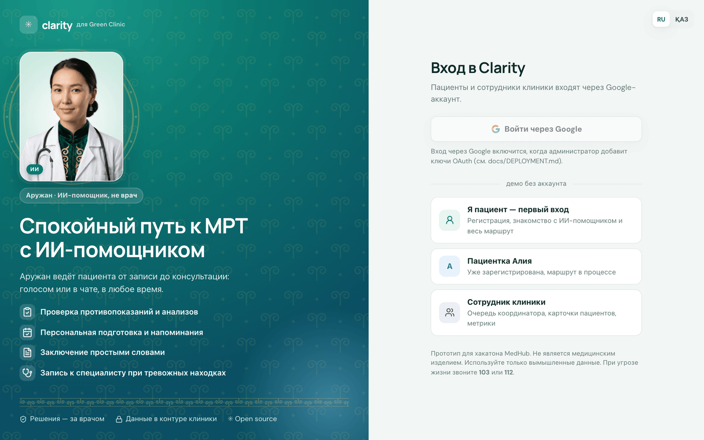<br><sub><b>Вход.</b> Google (OIDC + PKCE) или один из трёх демо-входов</sub></td>
<td align="center" width="50%">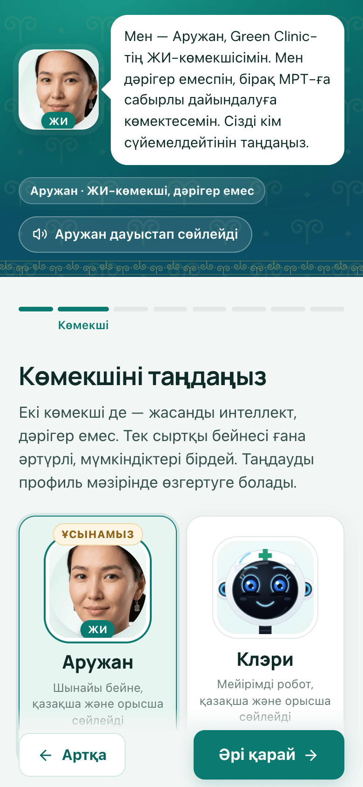<br><sub><b>Знакомство на казахском.</b> Выбор языка и аватара, мобильная версия</sub></td>
</tr>
</table>

**Главная пациента**

<table>
<tr>
<td align="center" width="50%"><br><sub><b>Главная (RU).</b> Аружан, один следующий шаг, статус маршрута</sub></td>
<td align="center" width="50%">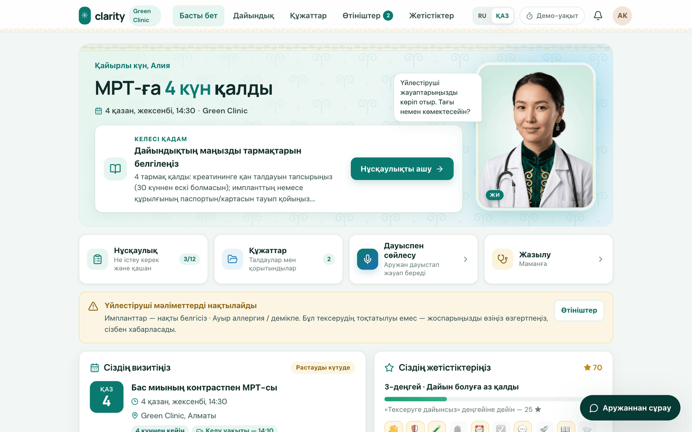<br><sub><b>Главная (ҚАЗ).</b> Весь маршрут на казахском языке</sub></td>
</tr>
</table>

**Разговор с ассистентом**

<table>
<tr>
<td align="center" width="50%">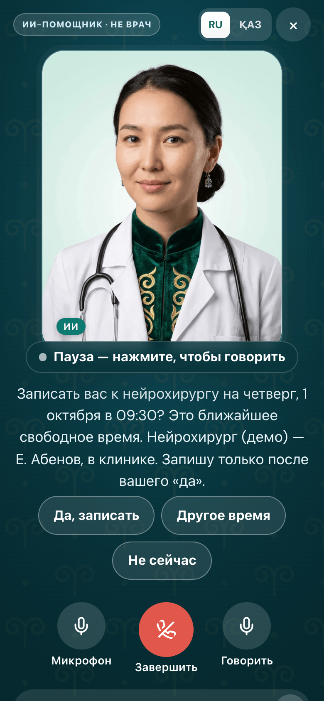<br><sub><b>Голосовой разговор.</b> Аружан говорит, затем сама слушает, как по телефону</sub></td>
<td align="center" width="50%">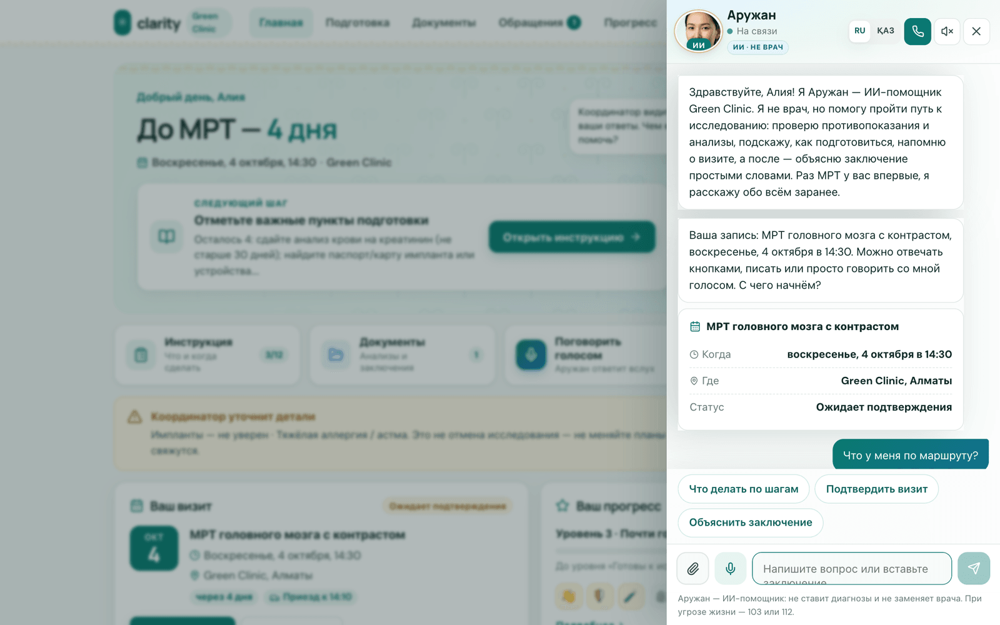<br><sub><b>Чат.</b> Проверка противопоказаний свободным текстом, «не помню» → координатор</sub></td>
</tr>
</table>

**До исследования: подготовка и анализы**

<table>
<tr>
<td align="center" width="50%">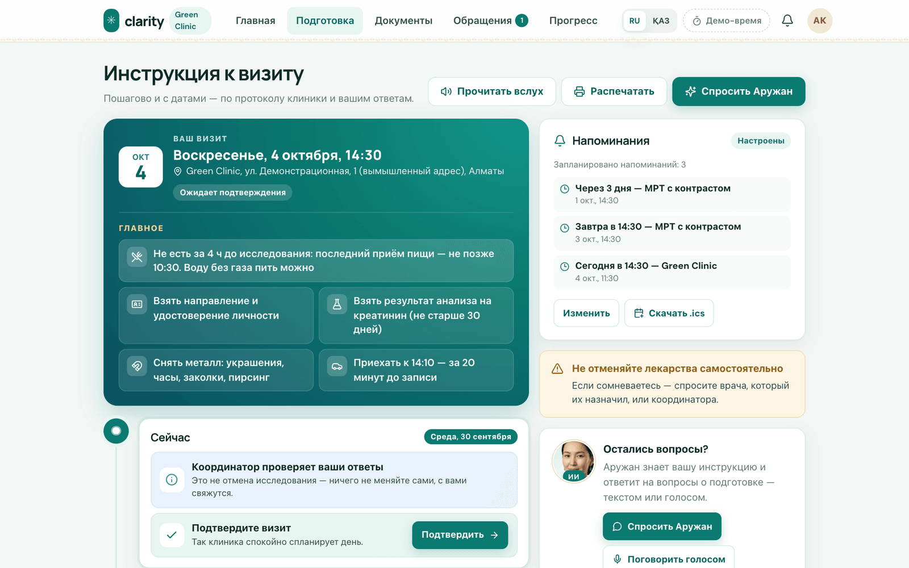<br><sub><b>Инструкция к визиту.</b> Шкала с конкретными датами и временем, «что сделать сейчас»</sub></td>
<td align="center" width="50%">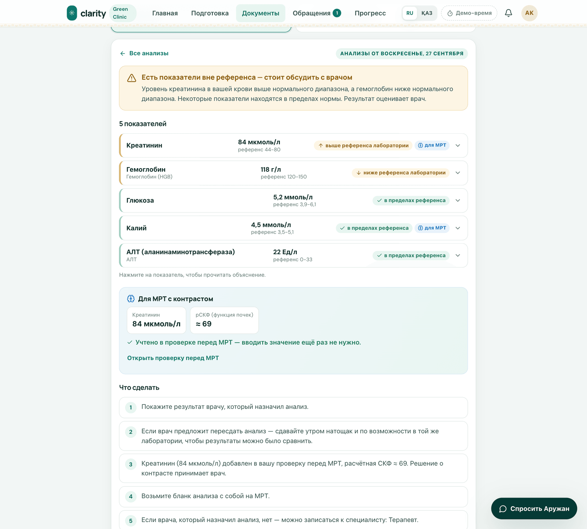<br><sub><b>Разбор анализов.</b> Статусы по референсам лаборатории, МРТ-блок: креатинин → рСКФ</sub></td>
</tr>
</table>

**После исследования**

<table>
<tr>
<td align="center" width="50%">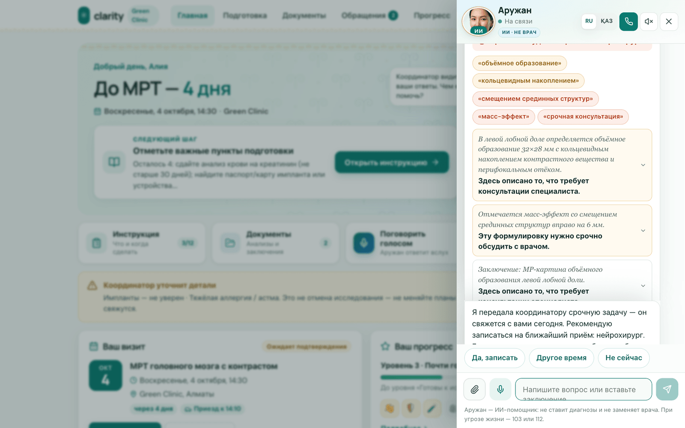<br><sub><b>Заключение.</b> Объяснение по предложениям, маркеры, оговорка и запись к специалисту</sub></td>
<td align="center" width="50%">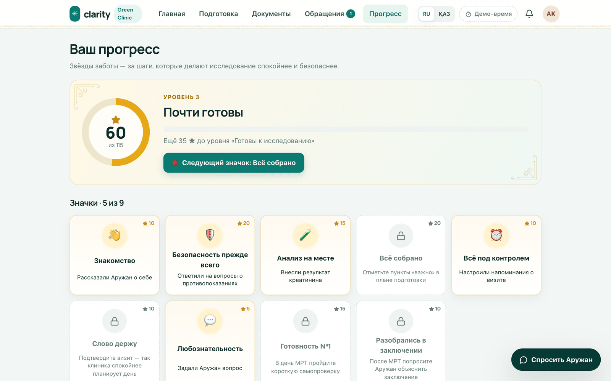<br><sub><b>Прогресс.</b> Звёзды и значки только за организационные шаги</sub></td>
</tr>
</table>

**Рабочее место клиники**

<table>
<tr>
<td align="center" width="50%">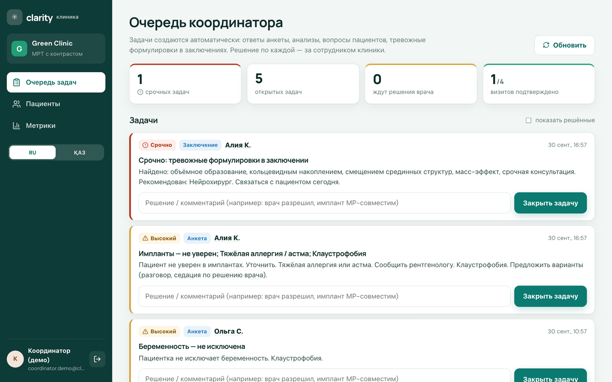<br><sub><b>Очередь координатора.</b> Задачи создаются автоматически и сортируются по приоритету</sub></td>
<td align="center" width="50%">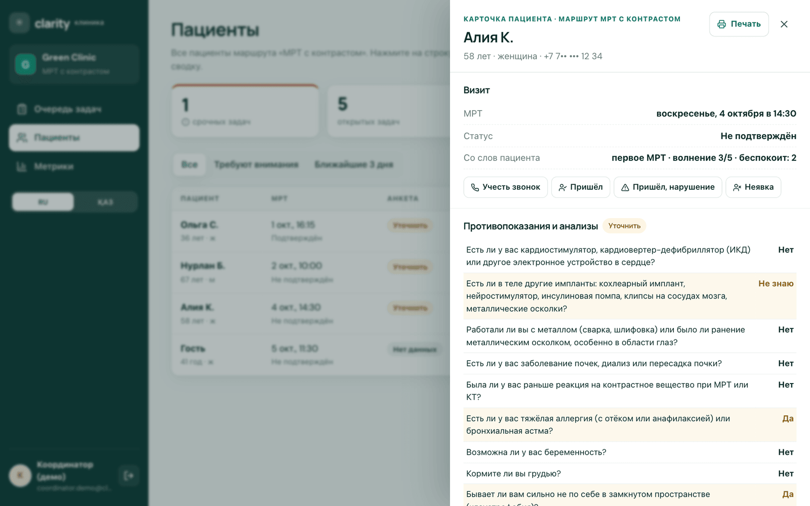<br><sub><b>Карточка пациента.</b> Анкета, рСКФ, заключение с маркерами, история, печать</sub></td>
</tr>
</table>

**Метрики и мобильная версия**

<table>
<tr>
<td align="center" width="50%">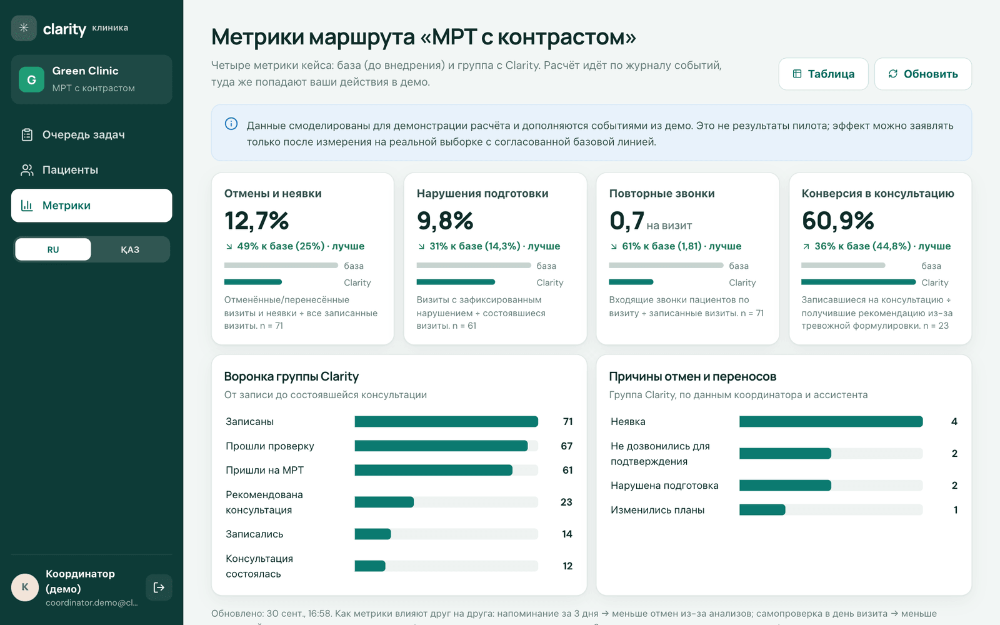<br><sub><b>Метрики.</b> 4 показателя кейса: база и Clarity, воронка, причины отмен</sub></td>
<td align="center" width="50%">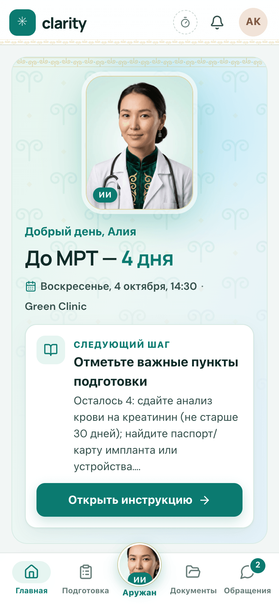<br><sub><b>Мобильная главная.</b> Нижняя навигация и большая кнопка ассистента</sub></td>
</tr>
</table>

**Аватар и айдентика**

<table>
<tr>
<td align="center" width="50%">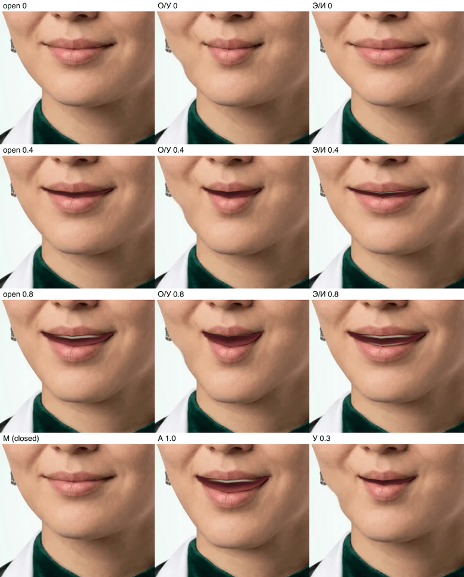<br><sub><b>Липсинк.</b> Кадры деформации губ Аружан: открытие, округление, растяжение, смыкание</sub></td>
<td align="center" width="50%">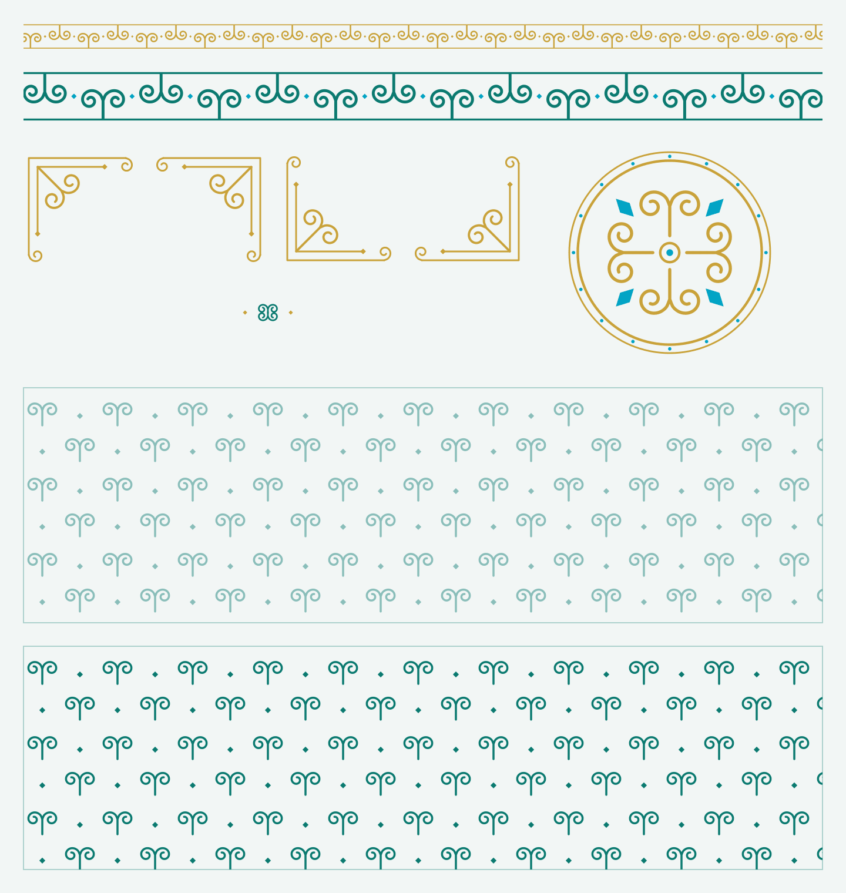<br><sub><b>Орнамент «қошқар мүйіз».</b> Деликатный казахский декор в SVG</sub></td>
</tr>
</table>

### Демо-сценарий за 3 минуты

Сокращённая версия [`clarity/docs/HACKATHON_DEMO.md`](clarity/docs/HACKATHON_DEMO.md). Начните на [mabida.tj](https://mabida.tj) или локально на `http://localhost:8787`. Для чистого старта сбросьте маршрут в меню профиля.

| Время | Что делаем | Что видит жюри |
| --- | --- | --- |
| 0:00–0:15 | Проблема одной фразой | «Перед МРТ с контрастом нужно проверить противопоказания, сдать креатинин и подготовиться. Ошибки ведут к отменам и звонкам. После исследования — непонятное заключение» |
| 0:15–0:45 | **«Я пациент — первый вход»** → знакомство | Язык и аватар, год рождения и пол «для расчёта функции почек», выбор окна МРТ, волнение и опасения, два согласия → значок «Знакомство» с конфетти, на главной — один следующий шаг |
| 0:45–1:25 | **«Пройти проверку»** в чате, отвечаем текстом | «нет» → «не помню точно» (импланты: «координатор уточнит») → посреди анкеты «Можно ли пить воду перед МРТ?» (ответ из базы знаний с источником и возврат к анкете) → на вопрос об аллергии «да, у меня астма» (пункт «ингалятор» в плане), остальные — «нет» → «креатинин 84» → «сдавала 20.09» → сводка: рСКФ по CKD-EPI 2021, давность, флаги |
| 1:25–1:55 | **Инструкция и напоминания** | «Инструкция к визиту» с датами; «За 3 дня, за день и за 3 часа» и файл `.ics`; **Демо-время → «Накануне»**: уведомления и баннер самопроверки; **«В день МРТ»**: ответ «Нет» на вопрос о еде → у координатора задача «Нарушение подготовки» |
| 1:55–2:25 | **«Через 2 дня после МРТ»** → Документы → заключение → **«Срочное»** | Уровень «Срочно», маркеры «масс-эффект» и «смещение срединных структур», нейрохирург; ассистент предлагает ближайший слот → «да» → запись. Пример «Есть находка»: глиоз — частая находка, демиелинизация → невролог, «без патологического накопления» распознано как отрицание |
| 2:25–2:40 | **Безопасность** | «мне трудно дышать» → 103/112 и задача координатору; «можно ли мне не пить таблетки?» → «это решает только врач» |
| 2:40–3:00 | Выход → **«Сотрудник клиники»** | Очередь с приоритетами, карточка нового пациента (анкета, рСКФ, заключение, история, «Печать»), **Метрики**: база и Clarity, воронка — с оговоркой, что история смоделирована |

**Если есть ещё 30 секунд — голос:** «Поговорить голосом» → «Я очень боюсь замкнутых пространств» → сочувственный ответ, ассистент снова слушает → «запиши меня к неврологу» → слоты. «Перебить» или пробел останавливают речь. На казахском: переключите ҚАЗ и спросите «МРТ алдында су ішуге бола ма?».

> **Ключевая фраза для защиты:** «ИИ не решает, можно ли вводить контраст. Он собирает ответы, считает рСКФ по формуле и передаёт сомнения врачу. Все правила детерминированные и покрыты тестами».
>
> **Чего не говорим:** «ИИ допускает к контрасту», «ИИ интерпретирует снимки» (он объясняет *текст* заключения), «мы снизили отмены на X %» (история смоделирована), «SMS отправлено» (доставка идёт в приложение, в уведомления браузера и через `.ics`).

## Запуск

### Вариант 1 — Docker, одна команда

```bash
cd clarity
docker compose up --build        # или: npm run docker:up
```

Откройте **http://localhost:8787** и войдите через демо-вход. Остановить: `Ctrl+C` или `docker compose down`.

- `.env` **не нужен**: без ключа LLM ассистент работает на правилах (все сценарии доступны), демо-вход включён, оба голоса (ru, kk) скачиваются при сборке образа. Если `.env` есть, он подхватывается автоматически.
- Требования: Docker Compose **≥ 2.24**, **≥ 2 ГБ** памяти для контейнера (рекомендуется 4 ГБ), около 1 ГБ диска, доступ к npm registry и GitHub при сборке (голоса ≈ 190 МБ). Архитектуры `linux/amd64` и `linux/arm64`, включая Apple Silicon без эмуляции.
- Многоэтапный `Dockerfile` на `node:20-bookworm-slim`: сборка фронтенда → загрузка голосов (отдельный кэшируемый слой) → runtime от пользователя `node` (не root), данные в томе `clarity-data`, `HEALTHCHECK` на `/api/health`.

```bash
docker compose logs -f clarity                 # логи
curl http://localhost:8787/api/health          # tts.voices: ["ru","kk"]; llm.configured: true, если задан ключ
docker compose down -v                         # сброс: удалит том с данными, демо-база создастся заново
docker compose build --build-arg RUN_CHECKS=true      # typecheck и тесты внутри сборки, как в CI
docker compose build --build-arg DOWNLOAD_VOICES=false # без голосов: клиент перейдёт на голос браузера или субтитры
```

Подробное руководство и решение проблем — [`clarity/docs/DOCKER.md`](clarity/docs/DOCKER.md).

### Вариант 2 — локальная разработка

Требуется **Node.js ≥ 20.6**.

```bash
cd clarity
npm install
cp .env.example .env                 # необязательно: ключ LLM, Google OAuth, STAFF_TOKEN
node scripts/download-voices.mjs     # необязательно: голоса Piper (~200 МБ) → server/models/tts
npm run dev                          # web :5173 + API :8787 (Vite проксирует /api)
```

Откройте **http://localhost:5173**. Без голосов озвучка перейдёт на Web Speech API браузера или субтитры.

```bash
npm run typecheck                    # TypeScript без сборки
npm test                             # 132 теста (Vitest)
npm run build && npm start           # production: один процесс отдаёт API и фронтенд на :8787
```

**HTTPS и микрофон.** Браузеры дают доступ к микрофону только на `localhost` или по HTTPS. Для сервера в [`clarity/deploy/`](clarity/deploy/) есть `docker-compose.prod.yml` с Caddy (автоматический HTTPS) — см. [`clarity/docs/DEPLOYMENT.md`](clarity/docs/DEPLOYMENT.md). Для любого пилота: `DEMO_LOGIN=false`, заданный `STAFF_TOKEN`, вход сотрудников через `STAFF_EMAILS`.

### Переменные окружения

Все переменные необязательны. Полный шаблон — [`clarity/.env.example`](clarity/.env.example). Секреты (ключи, client secret, токены) храните только в `.env`: он в `.gitignore`.

| Переменная | По умолчанию | Назначение |
| --- | --- | --- |
| `LLM_API_KEY` | — *(секрет)* | Ключ OpenAI-совместимого API. Пусто → режим правил |
| `LLM_BASE_URL` | `https://openrouter.ai/api/v1` | Endpoint: OpenRouter, Together, Groq, собственный vLLM или Ollama (`/v1`) |
| `LLM_MODEL` | `meta-llama/llama-3.3-70b-instruct` | Модель для русского диалога (≈ 0,5–1 с на ответ по замерам команды) |
| `LLM_MODEL_KK` | `meta-llama/llama-4-maverick` | Модель для казахского и для распознавания фото документов |
| `LLM_NO_AUTH` | `false` | `true` — собственный сервер модели без ключа |
| `LLM_TIMEOUT_MS` | `30000` | Таймаут запроса к модели |
| `LLM_PROVIDER_SORT` | `latency` | OpenRouter: выбор провайдера с минимальной задержкой |
| `HOST` | `127.0.0.1` | Адрес прослушивания (в Docker задаётся `0.0.0.0`) |
| `PORT` / `API_PORT` | `8787` | Порт API (в dev `API_PORT` фиксирует порт) |
| `PUBLIC_URL` | `http://localhost:5173` | Публичный адрес: redirect URI Google, флаг `Secure` у cookie |
| `DATA_FILE` | `server/data/db.json` | Файл JSON-хранилища (в Docker — `/data/db.json`) |
| `GOOGLE_CLIENT_ID` / `GOOGLE_CLIENT_SECRET` | — *(секрет)* | OAuth-клиент Google. Без них кнопка Google неактивна |
| `STAFF_EMAILS` | — | Google-аккаунты сотрудников через запятую |
| `STAFF_TOKEN` | — *(секрет)* | Сервисный доступ к `/api/staff/*` и `/api/metrics` по заголовку `x-staff-token` |
| `DEMO_LOGIN` | `true` | `false` выключает демо-вход, перемотку времени и сброс данных |
| `SESSION_DAYS` | `14` | Срок жизни сессии |
| `TTS_ENABLED` | `true` | `false` — серверный синтез выключен (`/api/tts` → 503) |
| `VOICES_DIR` | `server/models/tts` | Каталог моделей Piper |
| `TTS_KK_SPEAKER` | `2` | Диктор казахской модели (0–5), по умолчанию ISSAI_KazakhTTS2_F3 |
| `TTS_RU_SPEED` / `TTS_KK_SPEED` | `1.0` | Темп речи |
| `TTS_THREADS` | ядра / 2 (1–4) | Потоков ONNX на голос |
| `TTS_TIMEOUT_MS` | `45000` | Сколько запрос ждёт синтеза |
| `TTS_PRELOAD` | `true` | Прогрев обоих голосов через 2 с после старта |

Только для Docker (в `.env` или в оболочке): `CLARITY_PORT` (порт на хосте, `8787`), `CLARITY_BIND` (адрес на хосте, `127.0.0.1`), `CLARITY_PUBLIC_URL` (публичный адрес → `PUBLIC_URL` в контейнере, `http://localhost:8787`).

### Тесты и проверки

`npm test` — **132 теста в 8 файлах, все проходят** (Vitest 4). CI (`.github/workflows/ci.yml`) на каждый push и pull request в `main` запускает `typecheck → test → build`.

| Файл | Что проверяется |
| --- | --- |
| `tests/domain.test.ts` | CKD-EPI 2021, статусы проверки, мужчинам не задаются вопросы о беременности, персональный план, число напоминаний, отрицания и «не исключается», три примера заключений, NLU (да/нет/не знаю, мг/дл → мкмоль/л, даты), экстренные фразы, фильтр ответов |
| `tests/api.test.ts` | Авторизация: 401 без входа, CSRF, изоляция ролей, валидация знакомства, выход; сквозной маршрут через ассистента; действия клиники |
| `tests/dialog-v5.test.ts` | Инструкция по шагам, запись с подтверждением «да», вопросы по своим документам |
| `tests/documents.test.ts` | Разбор бланка правилами, статусы только по референсу лаборатории, API загрузки → подтверждения → анализа |
| `tests/i18n-server.test.ts` | Полнота казахских переводов, локализация состояния, база знаний и заключение на казахском, язык пациента в HTTP |
| `tests/kk-dialog.test.ts` | Сквозной диалог на казахском, казахский NLU, казахский слой безопасности |
| `tests/lipsync.test.ts` | Звук → кадр рта, офлайн-таймлайн по сэмплам, синтетический липсинк по тексту, подготовка текста к синтезу |
| `tests/tts.test.ts` | Числа словами (ru/kk), нормализация текста, WAV-заголовок |

## Структура проекта

Весь проект лежит в папке `clarity/`.

```text
.
├── README.md                          этот файл
└── clarity/
    ├── src/                           фронтенд: React 19 + TypeScript (Vite 6)
    │   ├── auth/Login.tsx             вход: Google + три демо-входа
    │   ├── onboarding/                знакомство после регистрации (8 шагов)
    │   ├── patient/                   главная, инструкция к визиту, документы, обращения, прогресс
    │   │   └── docs/                  загрузка и проверка анализов и заключений, разбор
    │   ├── assistant/                 аватары (RealisticAvatar — Аружан, Avatar — Клэри), чат, карточки, голосовой звонок
    │   ├── voice/                     движок озвучки, липсинк по звуку (lipsync.ts), деформация рта (mouthRig.ts)
    │   ├── hooks/useVoice.ts          Piper → Web Speech API → субтитры; распознавание речи ru-RU/kk-KZ
    │   ├── staff/                     очередь координатора, реестр и карточка пациента, метрики
    │   ├── brand/Ornament.tsx         казахский орнамент (SVG-компоненты)
    │   ├── i18n/                      словари интерфейса ru/kk
    │   └── styles/                    стили (крупный шрифт, prefers-reduced-motion, печать)
    ├── server/                        бэкенд: Fastify 5 + zod
    │   ├── index.ts, app.ts           запуск; HTTP-маршруты, валидация, раздача dist/
    │   ├── auth.ts                    Google OIDC (PKCE), сессии, роли, CSRF
    │   ├── services.ts                единственный слой мутаций: состояние, события метрик, задачи координатора
    │   ├── store.ts, seed.ts          JSON-хранилище (атомарная запись) и синтетические данные
    │   ├── config.ts                  конфигурация из переменных окружения
    │   ├── domain/                    детерминированное ядро — чистые функции без ввода-вывода
    │   │   ├── protocol.ts            протокол «МРТ с контрастом»: вопросы, подготовка, самопроверка, пороги
    │   │   ├── screening.ts           правила противопоказаний, CKD-EPI 2021, давность анализа
    │   │   ├── prep.ts, ics.ts        персональный план, расписание напоминаний, файл .ics
    │   │   ├── report.ts              разбор заключения: словарь, отрицания, маркеры, специалист
    │   │   ├── safety.ts              экстренное, запросы клинических решений, фильтр ответов, маскирование PII
    │   │   ├── nlu.ts                 да/нет/не знаю, креатинин, даты, намерения (ru/kk)
    │   │   ├── slots.ts               демо-расписание специалистов и окон МРТ
    │   │   ├── gamification.ts        звёзды, уровни, значки
    │   │   └── metrics.ts             4 метрики кейса, воронка, причины отмен
    │   ├── assistant/                 dialog.ts (сценарий + NLU), agent.ts (белый список действий), llm.ts, knowledge.ts
    │   ├── documents/                 PDF, текст и фото → показатели; каталог анализов; разбор по референсам
    │   ├── i18n/                      казахские тексты протокола, диалога, заключений, анализов; localizeState
    │   ├── tts/                       Piper через sherpa-onnx: worker_threads, LRU-кэш, нормализация текста, WAV
    │   └── models/, data/             голоса и db.json — создаются при запуске, в Git не хранятся
    ├── shared/                        общие типы и i18n для фронтенда и бэкенда
    ├── tests/                         Vitest: 8 файлов, 132 теста
    ├── scripts/                       загрузка голосов, генерация ассетов аватара, превью орнаментов
    ├── public/avatars/aruzhan/        портрет и кадры Аружан (WebP, ≈ 85 КБ) + manifest.json
    ├── docs/                          документация и скриншоты (docs/screenshots/)
    ├── deploy/                        docker-compose.prod.yml + Caddy (HTTPS) и скрипты развёртывания
    ├── Dockerfile, docker-compose.yml запуск одной командой
    ├── .env.example                   шаблон переменных окружения без секретов
    └── .github/workflows/ci.yml       CI: typecheck → test → build
```

Ключевые файлы для ревью:

| Что посмотреть | Файл |
| --- | --- |
| Все медицински значимые правила | [`clarity/server/domain/`](clarity/server/domain/) |
| Протокол маршрута (данные, не код) | [`clarity/server/domain/protocol.ts`](clarity/server/domain/protocol.ts) |
| Как LLM ограничена | [`clarity/server/assistant/agent.ts`](clarity/server/assistant/agent.ts), [`clarity/server/assistant/llm.ts`](clarity/server/assistant/llm.ts), [`clarity/server/domain/safety.ts`](clarity/server/domain/safety.ts) |
| Оркестратор диалога | [`clarity/server/assistant/dialog.ts`](clarity/server/assistant/dialog.ts) |
| Единый слой мутаций и событий метрик | [`clarity/server/services.ts`](clarity/server/services.ts) |
| Авторизация | [`clarity/server/auth.ts`](clarity/server/auth.ts) |
| Липсинк по звуку | [`clarity/src/voice/lipsync.ts`](clarity/src/voice/lipsync.ts), [`clarity/src/assistant/RealisticAvatar.tsx`](clarity/src/assistant/RealisticAvatar.tsx) |
| Серверный синтез речи | [`clarity/server/tts/index.ts`](clarity/server/tts/index.ts) |

## Что готово

**Маршрут пациента**

- [x] Вход через Google (OIDC + PKCE) и три демо-входа; роли «пациент» и «сотрудник»
- [x] Знакомство из 8 шагов с двумя явными согласиями; выбор языка, аватара, окна МРТ, режима крупного шрифта
- [x] Главная с одним «следующим шагом» и статусом всех шагов маршрута
- [x] Проверка противопоказаний: 9 вопросов, ответы кнопкой, текстом или голосом, исход «не помню»
- [x] Креатинин → рСКФ (CKD-EPI 2021), проверка давности, пороги из конфигурации
- [x] Документы: анализы из фото, PDF, текста или ручного ввода → проверка пациентом → разбор по референсу лаборатории (25 показателей), МРТ-блок
- [x] Заключение из фото, PDF или текста → проверка текста → объяснение: 30 терминов, отрицания, 19 маркеров трёх уровней, вопросы врачу, оговорка
- [x] Инструкция к визиту с датами, отметки, озвучка, печать
- [x] Напоминания (−72 ч, −24 ч, −3 ч), уведомления браузера, `.ics` с будильниками
- [x] Подтверждение, перенос и отмена визита с причиной
- [x] Самопроверка в день визита → нарушение подготовки фиксируется до приезда
- [x] Запись к специалисту (7 специальностей, демо-расписание), подтверждение «да», идемпотентность
- [x] Вопрос координатору и раздел «Обращения в клинику» с прозрачным статусом
- [x] Экстренные фразы ru/kk → 103/112; отказ на запросы клинических решений

**ИИ-ассистент**

- [x] Гибридный диалог: сценарий на правилах + LLM для свободной речи, ответов по базе знаний и пересказа
- [x] Разговорный агент с контекстом маршрута и белым списком из 10 действий, проверка ответа zod-схемой
- [x] База знаний: 18 карточек с версиями и ссылкой на источник под ответом
- [x] Полная работа без LLM (режим правил)
- [x] Голосовой режим «звонка»: говорит → слушает, перебивание, пауза при тишине, ввод текстом внутри звонка
- [x] Серверные голоса Piper ru/kk (sherpa-onnx, worker_threads, кэш, предзагрузка) с запасными путями
- [x] Реалистичный аватар Аружан с постоянным значком «ИИ/ЖИ» и робот Клэри на выбор; липсинк по звуку

**Язык и доступность**

- [x] Русский и казахский: интерфейс, диалог, протокол, база знаний, заключения, анализы, безопасность, голос
- [x] Адаптивная вёрстка, нижняя навигация на телефоне, шрифт от 16 px и режим крупного текста, `prefers-reduced-motion`
- [x] Казахский орнамент «қошқар мүйіз» как деликатный декор (скрывается при печати)

**Клиника и метрики**

- [x] Очередь координатора с автоматическими задачами и приоритетами
- [x] Реестр пациентов, карточка для врача с печатью, отметки «пришёл / неявка / нарушение подготовки», учёт звонков
- [x] 4 метрики кейса, воронка и причины отмен по журналу событий (24 типа событий)

**Инженерия**

- [x] 132 автотеста, CI (typecheck → test → build)
- [x] Docker одной командой (amd64/arm64), голоса в образе, healthcheck, том для данных
- [x] Валидация всех входящих данных (zod), CSRF-защита, хэши сессий, маскирование PII
- [x] Демо-время и сброс маршрута для показа (выключаются `DEMO_LOGIN=false`)

### Известные ограничения

- **Казахские медицинские тексты — черновой перевод.** Перед пилотом их должен вычитать клинический редактор, свободно владеющий казахским языком.
- **Распознавание речи идёт через браузер.** Используется Web Speech API; в Chrome аудио обрабатывается серверами Google. Перед первым включением микрофона пациент видит предупреждение. Для пилота нужен серверный STT (Whisper или Vosk) в контуре клиники.
- **Казахский синтез медленнее русского.** Модель `kk_KZ-issai-high` тратит 2–3 с на короткую фразу на 2-ядерном CPU (русский голос — около 0,4 с). Задержку смягчают синтез по фразам, предзагрузка следующей фразы, кэш и прогрев при старте.
- **Кадры губ Аружан частично процедурные.** Портрет сгенерирован один раз. Кадры рта и моргания синтезированы геометрической деформацией базового фото: генеративные правки кадров не удались (закончился баланс API генерации). На крупном плане анимация упрощённая.
- **Фото документов распознаёт внешняя vision-модель.** Используется `LLM_MODEL_KK` через `LLM_BASE_URL`, по умолчанию OpenRouter. Модели дано указание скрыть ФИО, ИИН и телефоны, результат дополнительно маскируется, но изображение уходит внешнему провайдеру целиком. Для реальных данных нужен провайдер в согласованной юрисдикции или своя модель. Текст из PDF и введённый текст извлекаются на сервере Clarity; в модель может уйти только уже извлечённый текст с замаскированными PII (для пересказа или если правила не нашли показателей). HEIC не поддерживается.
- **Нет интеграции с МИС.** Расписание специалистов и окна МРТ — детерминированное демо-расписание, запись существует только внутри прототипа.
- **Демо-расписание и демо-режим.** На стенде включены демо-вход, перемотка времени и сброс данных.
- **Напоминания без внешних каналов.** Они приходят в приложение и в уведомления браузера, пока приложение открыто (без push и service worker), а также через `.ics`. SMS и WhatsApp не подключены.
- **Метрики на смоделированной истории.** История «до/после» создана генератором, эффект нельзя заявлять до пилота (см. [Метрики](#метрики)).
- **Клинический контент не утверждён.** Протокол помечен `demo-0.3 — не утверждено клинически`, клинический владелец не назначен.
- **Хранилище и аудит.** JSON-файл в одном процессе подходит для демо, для пилота нужен PostgreSQL (интерфейс в `store.ts`) и журнал аудита действий сотрудников.
- **LLM по умолчанию — Llama.** Это открытые веса под Llama Community License, а не OSI-лицензия; модель вызывается через облачного провайдера. Для строгого open source — Qwen2.5-7B/14B/32B-Instruct (Apache-2.0) на собственном vLLM или Ollama.
- **Лицензия репозитория не выбрана.** Лицензия датасета русского голоса (RHVoice «Ирина») не указана в карточке модели: её нужно проверить или заменить голос до коммерческого использования.
- **Аудит доступности не проводился.** Формальная проверка клавиатуры, скринридеров и контраста ещё впереди.

### Чего Clarity сознательно не делает

Не ставит диагнозы, не назначает и не отменяет лечение, не решает вопрос о введении контраста, не отменяет визит автоматически, не интерпретирует снимки (только текст заключения), не придумывает референсы, дозировки и записи в расписании, не выдаёт себя за врача или человека.

## Архитектура

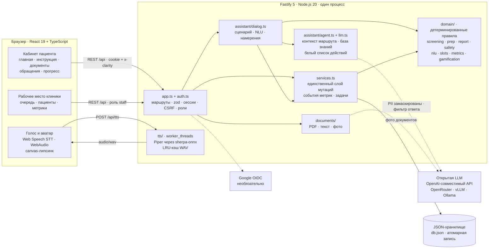
```mermaid
flowchart LR
  subgraph BR["Браузер · React 19 + TypeScript"]
    PT["Кабинет пациента<br/>главная · инструкция · документы<br/>обращения · прогресс"]
    SF["Рабочее место клиники<br/>очередь · пациенты · метрики"]
    VC["Голос и аватар<br/>Web Speech STT · WebAudio<br/>canvas-липсинк"]
  end

  subgraph SRV["Fastify 5 · Node.js 20 · один процесс"]
    RT["app.ts + auth.ts<br/>маршруты · zod · сессии · CSRF · роли"]
    DL["assistant/dialog.ts<br/>сценарий · NLU · намерения"]
    AG["assistant/agent.ts + llm.ts<br/>контекст маршрута · база знаний<br/>белый список действий"]
    SV["services.ts<br/>единственный слой мутаций<br/>события метрик · задачи"]
    DC["documents/<br/>PDF · текст · фото"]
    DM["domain/ · детерминированные правила<br/>screening · prep · report · safety<br/>nlu · slots · metrics · gamification"]
    TT["tts/ · worker_threads<br/>Piper через sherpa-onnx<br/>LRU-кэш WAV"]
  end

  LLM["Открытая LLM<br/>OpenAI-совместимый API<br/>OpenRouter · vLLM · Ollama"]
  DB[("JSON-хранилище<br/>db.json · атомарная запись")]
  GO["Google OIDC<br/>необязательно"]

  PT -->|"REST /api · cookie + x-clarity"| RT
  SF -->|"REST /api · роль staff"| RT
  VC -->|"POST /api/tts"| TT
  TT -->|"audio/wav"| VC
  RT --> DL
  RT --> SV
  RT --> DC
  DL --> DM
  DL --> SV
  DL --> AG
  AG -.->|"PII замаскированы · фильтр ответа"| LLM
  DC -.->|"фото документов"| LLM
  SV --> DM
  SV --> DB
  RT -.-> GO
```

**Путь реплики пациента (гибридный диалог).** Безопасность проверяется первой и без LLM, сценарий маршрута ведут правила, модель подключается только для свободной речи — и её ответ проходит проверку.

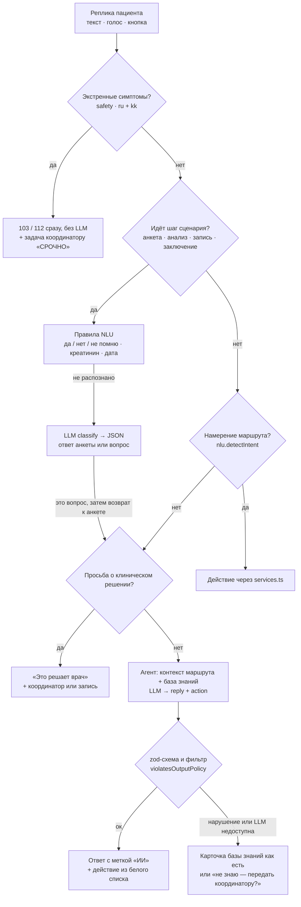
```mermaid
flowchart TD
  INP["Реплика пациента<br/>текст · голос · кнопка"] --> EM{"Экстренные симптомы?<br/>safety · ru + kk"}
  EM -->|"да"| E1["103 / 112 сразу, без LLM<br/>+ задача координатору «СРОЧНО»"]
  EM -->|"нет"| ST{"Идёт шаг сценария?<br/>анкета · анализ · запись · заключение"}
  ST -->|"да"| NL["Правила NLU<br/>да / нет / не помню · креатинин · дата"]
  NL -->|"не распознано"| CL["LLM classify → JSON<br/>ответ анкеты или вопрос"]
  CL -->|"это вопрос, затем возврат к анкете"| CD
  ST -->|"нет"| IT{"Намерение маршрута?<br/>nlu.detectIntent"}
  IT -->|"да"| AC["Действие через services.ts"]
  IT -->|"нет"| CD{"Просьба о клиническом решении?"}
  CD -->|"да"| RF["«Это решает врач»<br/>+ координатор или запись"]
  CD -->|"нет"| AGT["Агент: контекст маршрута + база знаний<br/>LLM → reply + action"]
  AGT --> CHK{"zod-схема и фильтр<br/>violatesOutputPolicy"}
  CHK -->|"ок"| OUT["Ответ с меткой «ИИ»<br/>+ действие из белого списка"]
  CHK -->|"нарушение или LLM недоступна"| KB["Карточка базы знаний как есть<br/>или «не знаю — передать координатору?»"]
```

### Ключевые технические решения

#### 1. Детерминированное ядро безопасности, LLM — только язык

- Флаги противопоказаний, рСКФ, давность анализа, уровень заключения, специальность, статусы анализов и эскалации — чистые функции в `server/domain/` и `server/documents/labAnalysis.ts`, покрытые тестами.
- LLM не получает права решать: она ведёт диалог, понимает свободную речь, перефразирует утверждённые карточки и пересказывает заключение. Уровень внимания передаётся ей как факт.
- Итог: поведение предсказуемо и проверяемо. Пропуск тревожной формулировки из-за «творчества» модели исключён, а без LLM всё работает.

#### 2. Гибридный диалог и белый список действий

- Сценарий маршрута — state machine (`screening → lab_has → lab_value → lab_date → summary`, `report_input`, `booking_pick → booking_confirm`, `cancel_reason`).
- Разговорный агент видит контекст маршрута (визит, статус шагов, опасения, документы), всю базу знаний и последние реплики. Он возвращает JSON `{reply, action}`. Действие выполняется только после проверки zod-схемой и фильтром безопасности и только из белого списка: `screening_start`, `prep`, `instruction`, `reminder_menu`, `visit_confirm`, `visit_cancel_start`, `report_start`, `booking_start{specialty}`, `human`, `status`.
- Голосовой режим: 1–3 коротких предложения без списков. Бюджет: `temperature 0.2`, ограничение `max_tokens`, таймаут, проверка доступности API раз в минуту.

#### 3. Двуязычие ru / kk сквозь весь стек

- Серверный контент хранится на русском, казахский перевод применяется на выходе (`localizeState`). Поэтому правила и тесты одни, а язык — свойство профиля пациента.
- Для казахского выбрана отдельная модель (Llama 4 Maverick: по тестам команды — самый естественный казахский среди проверенных открытых моделей) с персоной «отвечай только на казахском, на «Сіз»». Ответ не на том языке отбрасывается.
- NLU и шаблоны безопасности понимают «иә / жоқ / есімде жоқ», казахские экстренные фразы и ввод без казахской раскладки (свёртка қ→к, ә→а…).

#### 4. Голоса Piper через sherpa-onnx на сервере

- У браузеров нет казахских голосов, а русские звучат роботизированно. Поэтому используются открытые Piper-голоса `ru_RU-irina-medium` и `kk_KZ-issai-high` (диктор sid 2 = ISSAI_KazakhTTS2_F3 выбран объективно — по анализу F0 и энергии шести дикторов).
- Синтез идёт в отдельном `worker_threads`-потоке на язык, поэтому цикл событий Fastify не блокируется. Есть LRU-кэш (300 WAV / 64 МБ), склейка одинаковых запросов, перезапуск потока при сбое, лимит 150 запросов в минуту на пользователя.
- Нормализация текста для речи: «МРТ» → «эм-эр-тэ», числа словами на ru/kk (включая казахские суффиксы), время, даты, единицы, 103/112 поцифрово.
- Запасные пути: голос браузера → режим субтитров.

#### 5. Липсинк по реальному звуку

- После декодирования фразы весь аудиобуфер заранее разбирается в таймлайн: 100 кадров/с, FFT по полосам 150–700 / 700–1600 / 1600–3500 / 3500–8000 Гц → раскрытие, округление, растяжение и смыкание губ. Губы опережают звук на ~60 мс, как у человека. Кадр берётся по аудиочасам, без дрожания `AnalyserNode` (он остаётся запасным путём).
- Рот Аружан деформируется на `<canvas>` поверх базового фото: челюсть, губы, полость рта, без «двоения» кадров. Метод не зависит от языка, фонемные тайминги не нужны.

#### 6. Реалистичный аватар с постоянным раскрытием ИИ

- Аружан — вымышленный человек: портрет сгенерирован один раз, сходство с реальными людьми в промпте запрещено. Халат поверх камзола с орнаментом «қошқар мүйіз», без логотипов и красного креста.
- Значок «ИИ» / «ЖИ» виден всегда, `aria-label` — «ИИ-помощник (не врач)». Ассистент представляется как ИИ, согласие «понимаю, что это ИИ-помощник, а не врач» обязательно при знакомстве. Персона запрещает модели называть себя человеком, а фильтр отбрасывает ответы, где ассистент выдаёт себя за врача (в казахском — и за человека).
- Альтернатива — стилизованный SVG-робот Клэри: он явно не человек.

#### 7. Правила геймификации

- Звёзды только за шаги, которые пациент контролирует; ничего за показатели здоровья, результаты или «соблюдение».
- Нет рейтингов между пациентами, штрафов, таймеров и серий дней. Значок «Забота о себе» появляется, только если консультация была рекомендована или пациент уже записался.

#### 8. Прочее

- **Единый сервисный слой.** Форма и ассистент вызывают одни функции, поэтому события и задачи не расходятся.
- **Идемпотентность.** Повторная запись на слот возвращает существующую, задачи одного вида обновляются, а не дублируются.
- **Время.** Все расчёты идут через `now()` с демо-смещением, часовой пояс визитов — `Asia/Almaty`.
- **Хранилище за интерфейсом.** JSON с атомарной записью (tmp → rename) можно заменить на PostgreSQL без правки домена.
- **Graceful degradation.** Нет ключа или API упал — режим правил. Нет голосов — браузер или субтитры. Нет сервера — баннер с повтором.

### Открытый стек и лицензии

| Слой | Компонент | Лицензия |
| --- | --- | --- |
| UI | React 19.1, React DOM | MIT |
| Сборка | Vite 6.4, @vitejs/plugin-react | MIT |
| Иконки | lucide-react | ISC |
| Язык | TypeScript 5.9 | Apache-2.0 |
| Runtime | Node.js 20 (образ `node:20-bookworm-slim`) | MIT |
| API | Fastify 5.12, @fastify/static | MIT |
| Валидация | zod 3.25 | MIT |
| Запуск TS | tsx | MIT |
| PDF | pdfjs-dist 4.10 (текстовый слой) | Apache-2.0 |
| Синтез речи | sherpa-onnx-node 1.13 | Apache-2.0 |
| Голоса | Piper (формат и обучение VITS-голосов) | MIT |
| Голос kk | `kk_KZ-issai-high` — ISSAI KazakhTTS / KazakhTTS2, Назарбаев Университет | CC BY 4.0 (атрибуция ниже) |
| Голос ru | `ru_RU-irina-medium` — датасет RHVoice | в карточке модели не указана — проверить до пилота |
| Фонемизация | espeak-ng-data внутри архивов голосов | GPL-3.0 (используется как данные) |
| LLM (ru) | Llama 3.3 70B Instruct | Llama 3.3 Community License (открытые веса) |
| LLM (kk, фото) | Llama 4 Maverick | Llama 4 Community License (открытые веса) |
| LLM, OSI-альтернатива | Qwen2.5-7B/14B/32B-Instruct на собственном vLLM или Ollama | Apache-2.0 |
| Тесты и dev | Vitest 4, concurrently / sharp (скрипты ассетов) | MIT / Apache-2.0 |
| HTTPS в `deploy/` | Caddy 2 | Apache-2.0 |

**Что не является open source и чем это заменяется:**

| Компонент | Зачем | Замена для пилота |
| --- | --- | --- |
| Облачный провайдер LLM (по умолчанию OpenRouter) | Быстрый ответ без GPU на хакатоне | Собственный vLLM или Ollama клиники: `LLM_BASE_URL` + `LLM_NO_AUTH=true` |
| Распознавание речи браузера (в Chrome — сервис Google) | Ноль установки | Whisper или Vosk на сервере клиники |
| Google OIDC | Вход без паролей (необязателен) | SSO клиники |
| Модель изображений для портрета Аружан | Разовая генерация ассета, не зависимость времени выполнения | Не требуется в runtime |

<details>
<summary><b>HTTP API (40 маршрутов, кратко)</b></summary>

| Метод | Путь | Назначение |
| --- | --- | --- |
| GET | `/api/health` | Статус, LLM, голоса, версия протокола, демо-время |
| GET | `/api/protocol?lang=` | Вопросы, самопроверка, пороги анализов на языке интерфейса |
| GET | `/api/auth/me` · `/api/auth/google` · `/api/auth/google/callback` | Текущий пользователь, вход через Google (PKCE, state, nonce) |
| POST | `/api/auth/demo` · `/api/auth/logout` | Демо-вход (`new_patient` / `aliya` / `staff`), выход |
| PUT | `/api/prefs` | Язык и аватар |
| POST | `/api/tts` | Синтез речи → `audio/wav` |
| GET | `/api/me/state` | Всё состояние маршрута пациента |
| POST | `/api/me/onboarding` | Анкета знакомства (два обязательных согласия) |
| GET | `/api/mri-slots` | Окна МРТ для выбора при знакомстве |
| GET/POST | `/api/me/chat` | История / реплика `{text}` или действие `{action}`, режим `text` или `voice` |
| PUT | `/api/me/answers/:qid` · `/api/me/lab` · `/api/me/prep/:item` · `/api/me/reminders` | Ответ анкеты, креатинин, отметка подготовки, план напоминаний |
| GET/POST | `/api/me/notifications` · `/api/me/notifications/read` | Доставка наступивших напоминаний |
| GET | `/api/me/visit.ics` | Календарь с будильниками |
| POST | `/api/me/visit/confirm` · `/api/me/visit/reschedule` · `/api/me/day-of-check` | Подтверждение, перенос или отмена, самопроверка дня визита |
| POST | `/api/me/report` | Разбор заключения |
| POST | `/api/me/documents/extract` | Распознавание анализов или заключения (фото, PDF, текст) |
| PUT/DELETE | `/api/me/labs/:id` | Подтверждение значений пациентом → анализ / удаление |
| GET | `/api/slots?specialty=&urgent=` | Слоты специалиста |
| POST | `/api/me/bookings` · `/api/me/questions` · `/api/me/reset` | Запись (идемпотентно), вопрос координатору, сброс демо-маршрута |
| GET | `/api/staff/overview` | Пациенты и задачи (роль staff) |
| POST | `/api/staff/tasks/:id/resolve` · `/api/staff/visits/:id/outcome` · `/api/staff/calls` · `/api/staff/bookings/:id/complete` | Закрыть задачу, исход визита, учесть звонок, консультация состоялась |
| GET | `/api/metrics` | Метрики кейса (роль staff) |
| POST | `/api/demo/time` · `/api/demo/reset` | Демо: перемотка времени, пересоздание данных (выключаются `DEMO_LOGIN=false`) |

Изменяющие запросы требуют заголовок `x-clarity: 1`. Маршруты `/api/me/*` работают только с данными вошедшего пациента.

</details>

## Безопасность и этика

### Клинические границы

- Clarity — организационный помощник, а не медицинское изделие. Статусы проверки — организационные («координатор уточнит», «нужно решение врача до визита»), а не медицинский допуск. Визит никогда не отменяется автоматически.
- Все клинически значимые решения принимают правила из `server/domain/` и люди. Протокол и карточки базы знаний несут версию; при пилоте протокол, базу знаний и словарь терминов утверждает клинический владелец.
- Анализы оцениваются только относительно референса лаборатории; значения без референса не сравниваются. Тексты — «может встречаться при…, оценивает врач», без диагнозов.

### Честность ИИ

- Значок «ИИ» / «ЖИ» на аватаре виден всегда. Ассистент представляется как ИИ-помощник, «не врач». Реплики, сформулированные моделью, помечены «ИИ», под ответами из базы знаний указаны источник и версия карточки.
- Согласие «понимаю, что это ИИ-помощник, а не врач; при угрозе жизни звоню 103 или 112» обязательно при знакомстве (сервер проверяет его zod-схемой).
- Микрофон включается только после предупреждения о приватности.

### Аутентификация и доступ

- **Google OIDC**: Authorization Code + **PKCE (S256)**, `state` (дополнительно привязан к cookie) и `nonce`, проверка `iss`, `aud`, `exp`, `nonce`, `email_verified`. Сторонние библиотеки не используются — только `fetch` и `node:crypto`.
- **Сессии**: случайный 256-битный токен в cookie `HttpOnly; SameSite=Lax` (`Secure` на HTTPS). В хранилище лежит только **SHA-256-хэш** токена: утечка файла не даёт войти в чужую сессию. Срок жизни задаёт `SESSION_DAYS`, просроченные сессии удаляются.
- **CSRF**: любой изменяющий запрос без заголовка `x-clarity: 1` отклоняется с кодом 403.
- **Роли**: `patient` и `staff` (через `STAFF_EMAILS`). `/api/me/*` работает только с `req.user.patientId`, `/api/staff/*` и `/api/metrics` — только для персонала или по `x-staff-token`. Тесты проверяют 401 без входа, CSRF и изоляцию ролей.
- **Входные данные**: zod-схемы на всех маршрутах, лимит тела 64 КБ (12 МБ для загрузки документа, файл до 8 МБ), лимит запросов синтеза речи. Логи скрывают заголовки `authorization` и `cookie`.

### Приватность данных

- **Маскирование PII** перед отправкой в LLM: телефоны, email и ИИН (12 цифр) заменяются в репликах пациента.
- **Фильтр ответов** (`violatesOutputPolicy`, ru + kk): формулировки-диагнозы («у вас опухоль»), отмена лекарств, дозировки, «вам можно контраст», ложные заверения («не о чем беспокоиться»), «я врач» → ответ отбрасывается и заменяется текстом карточки или правилом.
- **Документы**: исходные файлы не сохраняются, хранятся только значения и текст, которые пациент проверил. Модели распознавания дано указание скрыть ФИО, ИИН, телефоны и адрес; результат дополнительно маскируется.
- **Синтетические данные**: демо-база генерируется из seed, файл данных и `.env` исключены из Git. Демо-вход, перемотка времени и сброс выключаются одной переменной `DEMO_LOGIN=false`.

### Экстренные ситуации

Шаблоны на русском и казахском — затруднение дыхания, отёк горла, языка или лица, боль в груди, потеря сознания, судороги, признаки инсульта, внезапная сильнейшая головная боль, суицидальные мысли, анафилаксия — проверяются **до** любой другой логики и без LLM. Пациент немедленно получает текст с **103 (скорая) / 112**, координатор — задачу с пометкой «СРОЧНО», в журнал пишется событие `emergency_detected`.

### Что уходит за пределы сервера Clarity

| Поток | Куда | Условие | Для реальных данных |
| --- | --- | --- | --- |
| Реплики пациента, текст заключения для пересказа, текст бланка, если правила не нашли показателей (PII замаскированы) | `LLM_BASE_URL` | Только если задан ключ | Провайдер в согласованной юрисдикции или собственный vLLM/Ollama |
| **Фото документов** | vision-модель `LLM_MODEL_KK` через `LLM_BASE_URL` | Только при загрузке фото | То же; изображение не маскируется до отправки |
| Аудио с микрофона | Сервис распознавания речи браузера (в Chrome — Google) | Только после предупреждения и включения микрофона | Серверный Whisper или Vosk |
| Вход | Google OIDC | Только если настроен OAuth | SSO клиники |

## Метрики

Все метрики считаются в [`clarity/server/domain/metrics.ts`](clarity/server/domain/metrics.ts) по журналу событий `AppEvent`. У каждого события есть когорта: `baseline` (до внедрения) или `clarity`. Формы и ассистент пишут события через один слой `services.ts`, поэтому способ взаимодействия на счёт не влияет.

| Метрика | Формула (как в коде) | Источники событий | Что в Clarity на неё влияет |
| --- | --- | --- | --- |
| **Отмены и неявки**, % | уникальные визиты с `visit_cancelled` ÷ уникальные визиты с `visit_scheduled` | Отмена пациентом (ассистент или форма); отмена клиникой и неявка — из карточки пациента. Перенос пишется отдельным событием `visit_rescheduled` и задачей «перезвонить» | Напоминание за 3 дня (анализ, направление), подтверждение накануне, ранний перенос с причиной освобождает слот |
| **Нарушения подготовки**, % | визиты с `prep_violation` ÷ визиты с `visit_attended` | Самопроверка пациента в день визита; отметка координатора «нарушение подготовки» | Персональный план, напоминания с конкретикой («не ешьте за 4 ч»), самопроверка до выхода из дома |
| **Повторные звонки**, на визит | число `inbound_call` ÷ записанные визиты | Кнопка «Учесть звонок» в карточке пациента (в пилоте — телефония или CRM) | Ответы ассистента по базе знаний 24/7, статус маршрута, прозрачные «Обращения в клинику» |
| **Конверсия в консультацию**, % | пациенты с `consultation_booked` (из получивших предложение) ÷ пациенты с `consultation_offered` | Тревожное заключение → предложение; запись через ассистента или форму | Детерминированные маркеры, ближайший слот с подтверждением «да», срочная задача координатору |

Дополнительно дашборд показывает **воронку** группы Clarity (записаны → прошли проверку → пришли на МРТ → рекомендована консультация → записались → консультация состоялась) и **причины отмен**.

> [!WARNING]
> **Демо-данные смоделированы.** История создана генератором с фиксированным seed ([`clarity/server/seed.ts`](clarity/server/seed.ts)): 140 визитов базы и 70 визитов группы Clarity. Параметры генератора заданы вручную и **не являются измерениями**. Действия в демо добавляют реальные события в группу Clarity, поэтому метрики меняются вживую: это демонстрация расчёта, а не результат. Эффект можно заявлять только после пилота.

**Что нужно для честного измерения в пилоте:**

1. Согласованная база: 2–3 месяца данных МИС и колл-центра до запуска.
2. Одинаковые определения событий в обеих группах (источник — МИС, а не приложение).
3. Сравнимые группы (например, по неделям или по случайному выбору канала приглашения).
4. Минимальный объём выборки и заранее заданный период анализа.
5. Метрики безопасности рядом с метриками эффекта: доля неподдержанных ответов на аудите, пропущенные эскалации, завершение маршрута по языку и возрастной группе.

## Дорожная карта

От хакатонного демо к ограниченному клиническому пилоту. Подробно — [`clarity/docs/DEVELOPMENT_ROADMAP.md`](clarity/docs/DEVELOPMENT_ROADMAP.md).

| Этап | Что сделать | Критерий перехода |
| --- | --- | --- |
| **0. Согласование маршрута** | Подтвердить маршрут с Green Clinic; назначить клинического владельца; получить утверждённые форму скрининга, инструкции и тексты эскалаций; описать действия персонала на «да / нет / не знаю», отсутствие анализа и недозвон | Протокол подписан клиническим владельцем, версия зафиксирована |
| **1. Клинический контент** | Вычитка базы знаний (18 карточек), словаря (30 терминов), маркеров (19 правил), каталога анализов и казахских переводов; у каждой единицы — источник, владелец, дата и версия | Нет неутверждённого клинического текста в пилотной сборке |
| **2. Защищённая основа** | PostgreSQL вместо JSON (интерфейс `store.ts`), резервные копии; журнал аудита действий сотрудников; SSO клиники; `DEMO_LOGIN=false`; модель угроз и review зависимостей; аудит доступности | Security- и privacy-review пройдены |
| **3. Данные и ИИ в контуре** | LLM и распознавание документов — на собственном GPU-сервере (vLLM + открытая модель) или у провайдера в согласованной юрисдикции; серверный STT (Whisper / Vosk); согласия, сроки хранения, удаление | Ни один поток медицинских данных не уходит неутверждённому получателю |
| **4. Интеграции** | МИС: расписание, запись, статусы визитов; SMS или WhatsApp через адаптер канала в `services.deliverDue`; телефония или CRM для учёта звонков | События метрик приходят из МИС, а не из приложения |
| **5. Пилот и оценка** | Usability-тесты с пациентами и координаторами на синтетике; ограниченный пилот с наблюдением, критериями остановки и быстрым отключением ИИ и напоминаний; сравнение с согласованной базой | Результат публикуется только с методикой, знаменателем, периодом и ограничениями |
| **6. Новые маршруты** | КТ, эндоскопия, маммография: новый протокол, база знаний и словарь для каждого (оркестратор диалога не меняется) — после отдельного workflow discovery с клиникой | Каждый маршрут проходит этапы 0–1 заново |

## Документация

| Документ | О чём |
| --- | --- |
| [`AI_AVATAR.md`](clarity/docs/AI_AVATAR.md) | Образ ассистента, голосовой разговор, гибридный диалог, защиты, объяснение заключения |
| [`AVATAR_ARUZHAN.md`](clarity/docs/AVATAR_ARUZHAN.md) | Как создан аватар Аружан, синтез кадров, этика использования |
| [`VOICES.md`](clarity/docs/VOICES.md) | Голоса Piper, выбор казахского диктора по F0, задержки, лицензии |
| [`ORNAMENTS.md`](clarity/docs/ORNAMENTS.md) | Казахский орнамент: мотивы, компоненты, правила использования |
| [`METRICS.md`](clarity/docs/METRICS.md) | Формулы метрик и честность данных |
| [`HACKATHON_DEMO.md`](clarity/docs/HACKATHON_DEMO.md) | Полный сценарий защиты |
| [`DOCKER.md`](clarity/docs/DOCKER.md) | Docker: требования, сборка, обновление, решение проблем |
| [`DEPLOYMENT.md`](clarity/docs/DEPLOYMENT.md) | Развёртывание, вход через Google, переменные окружения |
| [`TECHNICAL_OVERVIEW.md`](clarity/docs/TECHNICAL_OVERVIEW.md) | Стек, модули сервера, API, модель данных |
| [`DECISIONS.md`](clarity/docs/DECISIONS.md) | Журнал решений v1–v5 |
| [`DEVELOPMENT_ROADMAP.md`](clarity/docs/DEVELOPMENT_ROADMAP.md) | Подробный план до пилота и границы продукта |
| [`PRODUCT_BRIEF.md`](clarity/docs/PRODUCT_BRIEF.md) | Исходный продуктовый бриф |

Часть документов описывает более ранние версии (например, число тестов). Актуальное состояние отражает этот README.

## Лицензия и атрибуция

- Лицензия исходного кода проекта **пока не выбрана** (см. [`DECISIONS.md`](clarity/docs/DECISIONS.md)).
- Kazakh voice: Piper model trained on ISSAI KazakhTTS2 (CC BY 4.0), Nazarbayev University — <https://github.com/IS2AI/Kazakh_TTS>.
- Русский голос: Piper `ru_RU-irina-medium` (датасет RHVoice); синтез — sherpa-onnx (Apache-2.0, k2-fsa).
- Портрет «Аружан» сгенерирован ИИ для прототипа, изображает вымышленного человека и используется только как аватар ИИ-помощника Clarity с видимой пометкой «ИИ».
- Clarity — отдельный хакатонный проект; код, данные и инфраструктура других продуктов в нём не используются.
