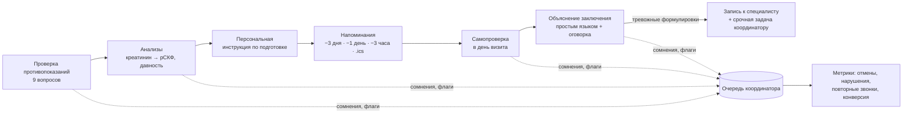

<div align="center">

# Clarity

### ИИ-помощник пациента на маршруте «МРТ головного мозга с контрастом»

**Diagnostic Companion · MedHub HAQathon · Green Clinic · open-source стек**

      

[ИИ-аватар и диалог](docs/AI_AVATAR.md) · [Архитектура](docs/TECHNICAL_OVERVIEW.md) · [Развёртывание](docs/DEPLOYMENT.md) · [Демо-сценарий](docs/HACKATHON_DEMO.md) · [Метрики](docs/METRICS.md) · [План развития](docs/DEVELOPMENT_ROADMAP.md) · [Решения](docs/DECISIONS.md)

</div>

> **Важно.** Это прототип, а не медицинское изделие. Clarity не ставит диагнозы, не решает вопрос о введении контраста и не отменяет исследования: всё, что требует клинического решения, передаётся координатору и врачу. Клинический контент — демонстрационный и требует утверждения назначенным врачом Green Clinic. Используйте только синтетические данные.

## Проблема и решение

Перед МРТ с контрастом пациенту нужно проверить противопоказания, сдать креатинин и правильно подготовиться. Нарушения подготовки ведут к отменам и повторным звонкам. После исследования заключение сложно понять без врача.

**Clarity** проводит пациента по цепочке вместе с ИИ-аватаром **Клэри**:



| Этап | Что работает | Кто принимает решение |
| --- | --- | --- |
| Противопоказания | 9 вопросов (кардиостимулятор, импланты, металл, почки, реакция на контраст, аллергия, беременность*, ГВ*, клаустрофобия). Ответы кнопками, текстом или голосом | Флаги → координатор/врач. Статус `hold_for_review` блокирует только подтверждение, не отменяет визит |
| Анализы | Креатинин → рСКФ по CKD-EPI 2021, проверка давности (≤ 30 дней), пороги 45/30 из конфигурации | Врач-рентгенолог |
| Подготовка | Персональный план по фазам (−3 дня, накануне, в день, после), пункты по ответам анкеты, отметки на сервере | Протокол клиники |
| Напоминания | Расписание от времени визита, доставка в приложение и уведомления браузера, файл календаря `.ics` с будильниками, подтверждение и перенос визита | Пациент |
| День визита | Самопроверка из 4 вопросов, нарушение → задача координатору | Координатор |
| Заключение | Разбор по предложениям, словарь из 30+ терминов, учёт отрицаний («не выявлено»), 3 уровня: routine / follow_up / urgent, вопросы врачу | Тревожность определяют правила, не LLM; интерпретирует врач |
| Консультация | Слоты специалиста по маркеру (невролог, нейрохирург, онколог, эндокринолог, ЛОР), запись в 2 шага, защита от дублей | Пациент подтверждает |
| Экстренное | Распознавание симптомов (затруднение дыхания, отёк горла, судороги…) → 103/112 + срочная задача | — |

\* — только для пациенток.

## Запуск одной командой (Docker)

```bash
docker compose up --build
```

Откройте http://localhost:8787. `.env` не обязателен: без ключа LLM ассистент работает на правилах, демо-вход включён, оба голоса (ru/kk) скачиваются при сборке образа. Требуется Docker Compose ≥ 2.24 и ≥ 2 ГБ памяти. Подробности — [docs/DOCKER.md](docs/DOCKER.md).

## Что нового в v5 — документы пациента

| Возможность | Как работает |
| --- | --- |
| 🧪 **Анализы** | Раздел «Документы»: фото бланка (камера телефона), PDF или текст → распознавание (vision-модель для фото, pdfjs для PDF, правила для текста) → **пациент проверяет значения** → разбор каждого показателя по референсу *из бланка лаборатории* (не выдумывается), понятные пояснения, чёткие рекомендации без диагнозов, вопросы врачу. Креатинин автоматически попадает в проверку перед МРТ (рСКФ) |
| 📄 **Заключение врача** | Фото/PDF/текст → распознанный текст на проверку → объяснение простыми словами; вопросы по своему заключению и анализам — текстом или голосом («что значит глиоз в моём заключении?») |
| 📅 **Чёткая инструкция** | «Инструкция к визиту»: таймлайн с конкретными датами и временем (последний приём пищи, приезд), блок «что сделать сейчас», озвучка и печать; ассистент по запросу «что мне делать?» выдаёт план по дням |
| 🩺 **Запись к специалисту** | При тревожных формулировках в заключении или отклонениях в анализах ассистент сразу предлагает ближайшее время у нужного специалиста («Записать вас к неврологу на …?») и записывает после «да» |
| 👄 **Липсинк v2** | Звук каждой фразы анализируется заранее (дорожка 100 кадров/с) с упреждением 60 мс; губы Аружан деформируются плавно на canvas без «двоения» кадров; во время синтеза — состояние «думает» |
| 🐳 **Docker** | Одна команда, многоэтапная сборка на bookworm, голоса в образе, amd64/arm64 |

## Что нового в v4 — қазақ тілі

| Возможность | Как работает |
| --- | --- |
| 🇰🇿 **Казахский язык** | Весь интерфейс, диалог, анкета, подготовка, напоминания, база знаний и объяснение заключения — на русском или казахском. Переключатель RU / ҚАЗ в шапке, на входе и в первом шаге знакомства; выбор сохраняется в профиле |
| 👩‍⚕️ **Аружан** | Реалистичный ИИ-аватар: вымышленная девушка казахской внешности в медицинском халате поверх камзола с орнаментом «қошқар мүйіз». Говорит по-русски и по-казахски; значок «ИИ/ЖИ» виден всегда. Робот Клэри остаётся на выбор |
| 🗣️ **Качественная озвучка** | Открытые голоса Piper через sherpa-onnx на сервере (kk_KZ-issai-high, ru_RU-irina-medium) вместо роботизированных голосов браузера; синтез в отдельном потоке, кэш, предзагрузка следующей фразы |
| 👄 **Липсинк по звуку** | Рот аватара управляется реальным аудио: анализ спектра (WebAudio) → раскрытие, округление, растяжение и смыкание губ; кадры губ Аружан смешиваются в реальном времени |
| 🧠 **Разговор на казахском** | Для казахского — Llama 4 Maverick (лучшая по грамотности среди протестированных открытых моделей), понимание ответов «иә / жоқ / есімде жоқ», экстренных фраз и вопросов на казахском, распознавание речи kk-KZ |
| ✳ **Казахский орнамент** | Мотивы «қошқар мүйіз», «су өрнегі» и розетка в SVG: вход, знакомство, главная, голосовой разговор, награды — деликатно, золотом и бирюзой |

> Казахские медицинские тексты — черновой перевод. Перед пилотом их должен вычитать клинический редактор, свободно владеющий казахским языком.

## Что нового в v3

| Возможность | Как работает |
| --- | --- |
| 🎙️ **Голосовой разговор** | Режим «звонка»: Клэри отвечает вслух и сама начинает слушать, как по телефону. Можно перебить её, выключить микрофон или ответить кнопкой. На телефоне это большая кнопка Клэри в нижней навигации |
| 🧠 **Живой диалог** | Разговорный агент на открытой LLM (Llama 3.3 70B, ответ ~1 с) знает маршрут пациента и всю базу знаний клиники. Сам запускает действия («запиши меня к неврологу» → слоты). Не выдумывает внешние факты |
| 🔐 **Вход через Google** | OAuth 2.0 / OpenID Connect с PKCE, серверные сессии в httpOnly-cookie, роли «пациент» и «сотрудник» (`STAFF_EMAILS`). Демо-вход без аккаунта для защиты проекта |
| 👋 **Знакомство после регистрации** | 6 шагов с голосом Клэри: имя, возраст и пол (для рСКФ), выбор времени МРТ, первое ли МРТ, уровень волнения, опасения, голос и крупный шрифт, согласия |
| ⭐ **Геймификация** | «Звёзды заботы», 5 уровней, 10 значков только за организационные шаги; празднование с конфетти. Без рейтингов, штрафов и серий дней |
| 🎨 **Редизайн** | Шрифт 16px+ и режим крупного текста, нижняя навигация и шторки на телефоне, «следующий шаг» на главной. Для врачей — реестр пациентов, карточка с клинической сводкой и печатью |

## ИИ-аватар Клэри

Клэри — стилизованный робот-медсестра (SVG): чёрный визор со светящимися глазами, халат, стетоскоп. Она **явно не человек**, чтобы пациент не принял ИИ за врача.

- **Мимика:** моргание, глаза следят за курсором, 5 настроений (нейтрально, радость, раздумье, беспокойство, слушает), губы синхронизированы с речью.
- **Голос:** синтез и распознавание речи через Web Speech API браузера (ru-RU), субтитры, отключение голоса. Микрофон включается только после предупреждения о приватности.
- **Мозг:** гибрид. Сценарий маршрута ведёт детерминированный автомат состояний, а LLM (открытая модель через OpenAI-совместимый API) используется только для понимания свободной речи, ответов из базы знаний со ссылкой на источник и пересказа заключения.
- **Без LLM всё работает:** если ключ не задан, Клэри отвечает по правилам и базе знаний.

Подробно — [docs/AI_AVATAR.md](docs/AI_AVATAR.md).

## Быстрый старт

Требуется Node.js 20.6+.

```bash
npm install
cp .env.example .env   # по желанию: LLM_API_KEY для открытой модели
npm run dev
```

Откройте `http://localhost:5173`. API работает на `:8787` (Vite проксирует `/api`).

На экране входа есть три демо-входа: **новый пациент** (регистрация и знакомство), **пациентка Алия** (маршрут начат) и **сотрудник клиники** (очередь, реестр, метрики). Вход через Google включается переменными `GOOGLE_CLIENT_ID` и `GOOGLE_CLIENT_SECRET` (см. [DEPLOYMENT.md](docs/DEPLOYMENT.md#вход-через-google)).

```bash
npm run typecheck   # TypeScript
npm test            # 38 тестов: правила, рСКФ, заключения, NLU, безопасность, авторизация, сквозной API
npm run build && npm start   # production: один процесс отдаёт API и фронтенд на :8787
```

Развёртывание на сервере одной командой: `docker compose up -d --build` (см. [DEPLOYMENT.md](docs/DEPLOYMENT.md)).

### Подключение LLM (open source через API)

| Провайдер | `LLM_BASE_URL` | `LLM_MODEL` |
| --- | --- | --- |
| OpenRouter (по умолчанию) | `https://openrouter.ai/api/v1` | `meta-llama/llama-3.3-70b-instruct` (~1 с, для голоса) или `qwen/qwen-2.5-72b-instruct` (Apache-2.0, 5–9 с) |
| Together | `https://api.together.xyz/v1` | `meta-llama/Llama-3.3-70B-Instruct-Turbo` |
| Groq | `https://api.groq.com/openai/v1` | `llama-3.3-70b-versatile` |
| Свой vLLM / Ollama | `http://host:8000/v1` | любая открытая модель + `LLM_NO_AUTH=true` |

Перед отправкой в модель телефоны, email и ИИН маскируются. Для реальных данных пациентов нужен провайдер в согласованной юрисдикции или собственный сервер клиники.

## Демо за 3 минуты

0. **Я пациент — первый вход** → знакомство с Клэри (6 шагов) → значок «Знакомство».
1. **Поговорить голосом** (или «Написать Клэри») → «Пройти проверку». Ответьте текстом «не помню» на вопрос про импланты, спросите посреди анкеты «можно ли пить воду?», затем напишите «креатинин 84» и «сдавала 20.09».
2. Покажите сводку: рСКФ, флаги, задачу в **консоли координатора**.
3. «Как подготовиться» → персональный план с отметками. «Настроить напоминания» → скачайте `.ics`.
4. **Демо-время** (часы в шапке) → «Накануне». Придут напоминания и появится баннер самопроверки.
5. «Объяснить заключение» → «Пример: тревожный». Покажите подсветку маркеров, уровень «срочно» и запись к нейрохирургу.
6. Напишите «мне трудно дышать» → экстренный ответ 103/112.
7. **Метрики** → отмены, нарушения подготовки, повторные звонки, конверсия (база и Clarity).

Полный сценарий защиты — [docs/HACKATHON_DEMO.md](docs/HACKATHON_DEMO.md).

## Архитектура

```text
src/                       React 19 + TypeScript (Vite)
  assistant/Avatar.tsx     SVG-аватар Клэри (мимика, губы, взгляд)
  assistant/AssistantPanel Разговор: голос, субтитры, быстрые ответы, карточки
  assistant/Cards.tsx      Карточки: проверка, подготовка, напоминания, заключение, слоты
  assistant/VoiceCall.tsx  Голосовой разговор («звонок» с Клэри)
  hooks/useSpeech.ts       Web Speech API: очередь TTS, STT, анимация губ
  auth/Login.tsx           Вход: Google + демо
  onboarding/              Знакомство после регистрации
  patient/                 Главная, подготовка, прогресс, обращения, формы шагов
  staff/                   Очередь, реестр и карточка пациента, метрики
server/                    Fastify 5 + zod
  domain/protocol.ts       Протокол МРТ с контрастом (версионируемый, конфигурируемый)
  domain/screening.ts      Правила противопоказаний, CKD-EPI 2021
  domain/prep.ts           План подготовки и расписание напоминаний
  domain/report.ts         Словарь терминов, тревожные маркеры, отрицания
  domain/safety.ts         Экстренные симптомы, запрет клинических решений, фильтр ответов LLM
  domain/nlu.ts            Разбор свободного текста (да/нет, числа, даты, намерения)
  domain/metrics.ts        4 метрики кейса из журнала событий
  assistant/dialog.ts      Оркестратор диалога (state machine + LLM)
  assistant/agent.ts       Разговорный агент: контекст маршрута + база знаний + белый список действий
  auth.ts                  Google OIDC (PKCE), сессии, роли, CSRF
  domain/gamification.ts   Звёзды, уровни и значки
  assistant/llm.ts         OpenAI-совместимый адаптер
  assistant/knowledge.ts   База знаний (retrieval-first)
  services.ts              Единый сервисный слой: формы и ИИ пишут одни события
  store.ts                 JSON-хранилище (интерфейс для замены на PostgreSQL)
shared/types.ts            Общие типы frontend/backend
tests/                     Vitest: домен + сквозной API
```

Все зависимости open source (MIT/ISC/Apache-2.0): React, Vite, Fastify, zod, lucide-react, tsx, vitest.

## Границы прототипа

- Данные синтетические. Вход через Google работает после настройки OAuth-клиента; демо-вход выключается `DEMO_LOGIN=false`.
- Расписание специалистов и запись — демонстрационные, без интеграции с МИС.
- Напоминания доставляются в приложение, в уведомления браузера и через `.ics`. SMS и WhatsApp подключаются адаптером канала в пилоте.
- Метрики считаются по реальному журналу событий, но история «до/после» смоделирована. **Эффект нельзя заявлять до пилота.**

## Голоса и авторство

Казахский голос — ISSAI KazakhTTS2 (CC BY 4.0), русский — Piper ru_RU-irina-medium; синтез — sherpa-onnx (Apache-2.0). Подробности и лицензии — [docs/VOICES.md](docs/VOICES.md). Аватар «Аружан» — вымышленный человек, см. [docs/AVATAR_ARUZHAN.md](docs/AVATAR_ARUZHAN.md); орнаменты — [docs/ORNAMENTS.md](docs/ORNAMENTS.md).

Голоса скачиваются командой `node scripts/download-voices.mjs` (≈200 МБ, в Git не хранятся).

## Лицензия

Лицензия проекта пока не выбрана (см. [DECISIONS.md](docs/DECISIONS.md)).
